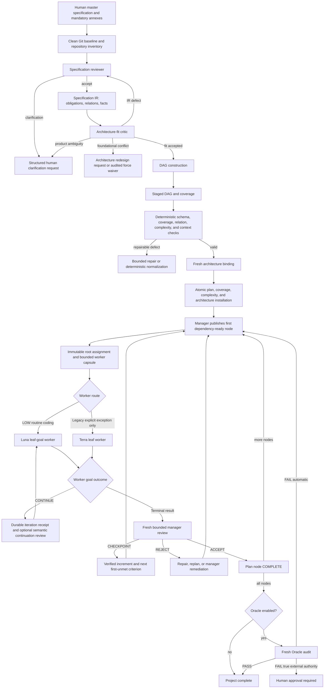
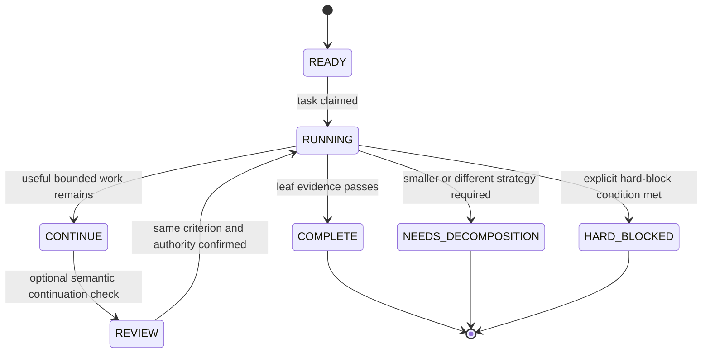
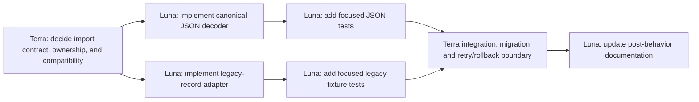
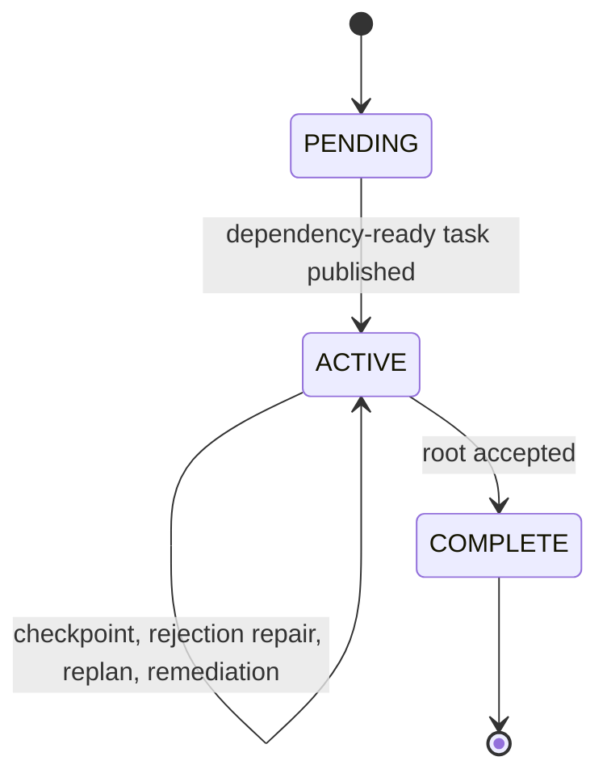
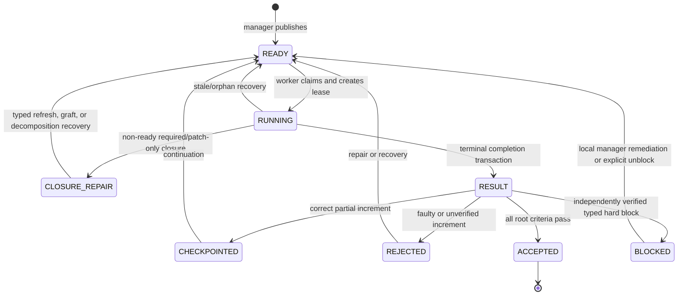
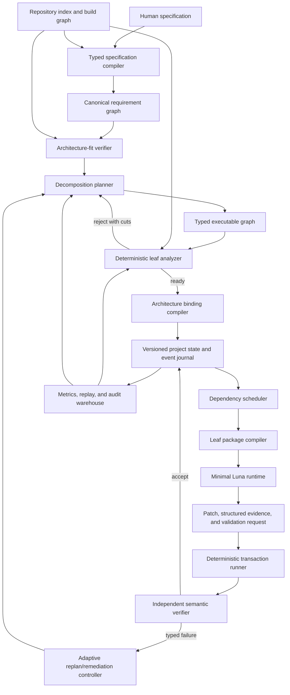

# Specification-to-Luna Complexity Decomposition Architecture

Status: as-built architecture and improvement guide

Repository baseline reviewed: `bbe211d` (`main`, 2026-08-17)

Primary scope: Full mode with decomposition v2, leaf-goal execution, Luna-first and Luna-only operation, Context Closure, and architecture guards
Audience: software architects, technical program managers, agent-platform engineers, reliability engineers, and maintainers of the coding harness

## Executive summary

The goal of this harness is not merely to send parts of a specification to multiple agents. Its real goal is to compile a large, human-authored specification into a sequence of implementation-ready work packets that a smaller Luna-class coding model can execute with minimal ambiguity, minimal discovery, bounded authority, bounded context, and deterministic proof of completion.

The Full-v2 path implements that goal as a series of durable transformations:

```text
human product authority
  -> accepted specification baseline
  -> normalized obligations and typed relations
  -> architecture-fit decision
  -> immutable executable DAG and obligation coverage
  -> measured complexity and policy-valid worker routing
  -> architecture bindings and cumulative health gates
  -> one dependency-ready root assignment
  -> one first-unmet leaf goal and bounded context capsule
  -> bounded Luna worker episodes, or a closed patch transaction
  -> independent manager verification and durable evidence
  -> complete obligation coverage
  -> optional independent Oracle audit
```

This is fundamentally a compiler pipeline. The specification is source language; normalized requirements, relations, architecture contracts, and the execution DAG are intermediate representations; the Luna assignment is target code; manager and Oracle reviews are verification passes; and the filesystem is the durable build database.

The architecture's strongest properties are:

- specification authority is separated from repository observations and planning hints;
- every installed DAG node must be executable, topologically valid, covered by at least one normalized obligation, and independently acceptance-complete;
- routine coding is forced toward `LOW`/`LUNA`; in `luna_only` mode every
  executable boundary, including planning, review, remediation, and final
  audit, is executed by the configured Luna model;
- Luna admission uses a multidimensional resource contract rather than a subjective `small` label;
- assignments copy immutable DAG fields and architecture bindings, so a manager cannot silently broaden a leaf;
- worker progress, checkpoints, reviews, commits, architecture impacts, and recovery transitions are durably recorded;
- non-ready Context Closure admission is a typed internal recovery transaction,
  not a synthetic worker result or a paid manager-review turn;
- only a terminal worker result wakes the manager; ordinary waiting is performed by token-free Bash supervisors;
- coverage, architecture health, debt, and optionally every normalized obligation are independently checked at completion.

The most important opportunities for improvement are:

1. Replace the long Luna protocol with a generated, leaf-type-specific execution contract and move more transaction mechanics out of the model.
2. Make semantic atomicity, repair-authority closure, and validation locality machine-checkable instead of relying substantially on planner instructions. The current closure-graft compiler is an important first implementation of this rule.
3. Consolidate Markdown, TSV, and key/value schemas into one versioned typed schema and compiler library.
4. Treat decomposition quality as an empirically evaluated product with current-v5 benchmarks, replayable planner evals, and outcome-stratified calibration.
5. Promote repository Context Closure from optional evidence to an earned, benchmark-gated Luna admission control; use `patch_only` only after its closed-context cohort has earned that authority.
6. Generate node-local criteria and worker packages directly from the accepted DAG to remove a late manager-authored interpretation layer.
7. Introduce parallel DAG waves only after isolated worktrees, merge ownership, and cross-leaf validation semantics exist; the current implementation is deliberately serial.

The accompanying [improvement backlog](complexity-decomposition-improvement-backlog.tsv) turns these findings into prioritized, measurable architecture work.

## 1. Goal, boundary, and success definition

### 1.1 Primary goal

For every implementation obligation in a large specification, produce the smallest cohesive leaf that preserves the intended semantics and that Luna can implement without needing to rediscover product decisions, architecture, repository topology, or the completion test.

The desired Luna experience is:

```text
one behavior
+ one bounded repair surface
+ named symbols at known locations
+ resolved prerequisite contracts
+ one focused validation
+ an explicit result protocol
= a predictable implementation episode
```

A smaller leaf is not automatically a better leaf. A useful leaf must be both:

- semantically complete enough to create a monotonic, independently useful result; and
- operationally small enough to remain within Luna's context, action, file, symbol, risk, and token budgets.

The architecture therefore optimizes for the largest cohesive leaf that satisfies every Luna constraint, not the maximum possible number of tiny tasks.

### 1.2 What the harness decomposes

The harness decomposes four different kinds of complexity:

| Complexity | Source | Reduction mechanism | Luna-visible result |
|---|---|---|---|
| Product complexity | Normative requirements, compatibility promises, completion rules | Atomic obligations and typed semantic relations | Only obligations allocated to the leaf |
| Architecture complexity | Ownership, public contracts, representations, decisions, concurrency, integration | Accepted decision/evidence stages, architecture registry, edge contracts, health gates | Resolved decisions and exact affected contracts |
| Repository complexity | Paths, symbols, producers, consumers, build targets, tests | Repository facts, index, symbol locations, Context Closure | Bounded paths, symbols, definitions, tests, and build targets |
| Execution complexity | Number of concerns, failures, actions, files, validations, tokens | Measured complexity vector, routing rules, process and goal fuses | A bounded action and turn budget |

### 1.3 What the harness does not currently do

The ordinary Full harness does not launch one worker per independent DAG branch. It publishes one dependency-ready plan item at a time and permits only one active plan item. The DAG expresses semantic order and readiness, but execution is serialized through one shared repository workspace.

It also does not prove that a planner's semantic split is optimal. Deterministic validators reject several invalid or oversized plans, but some important properties—such as whether a leaf really contains exactly one cohesive behavioral concern—still depend on model judgment plus later outcome evidence.

### 1.4 Outcome-level success criteria

An architect should judge the decomposition architecture by the following outcomes:

- Luna terminal success rate for admitted routine coding leaves;
- accepted results per Luna invocation, not merely tasks published;
- manager reviews and replans per verified criterion;
- worker tokens and actions per verified item;
- percentage of routine coding leaves executed by Luna;
- Context Closure file recall and false-block rate;
- frequency of `CONTEXT_INCOMPLETE`, `SCOPE_INCOMPLETE`, and `TASK_TOO_BROAD` outcomes;
- prediction error between declared/effective p95 and observed tokens/actions/files;
- obligation coverage verified at final completion;
- architecture gate, edge compatibility, and debt closure rates;
- defect escape rate found by the final Oracle or external grader;
- time and cost from accepted specification to verified behavior.

Route share alone is not a success metric. Forcing 95% of leaves onto Luna while increasing retries, manager reviews, or escaped defects would be a regression.

### 1.5 Operating profiles: compatibility versus Luna-only convergence

The harness supports two deliberately different model policies. They share the
same specification authority, decomposition artifacts, validation, and durable
state. They differ only in whether stronger-model escalation is permitted.

| Policy | Purpose | Routing rule when a boundary is difficult | Process-launch rule |
|---|---|---|---|
| `legacy` | Preserve compatibility with existing Full-v2 projects while the Luna-only system is promoted | A measured, explicitly justified Terra exception may execute a decision or irreducible integration boundary | Roles use their configured Luna, Terra, Sol, or Oracle models |
| `luna_only` | The target complexity-decomposition product: make a small model sufficient through better compilation and recovery | Recursively decompose, compile a closure repair, add a local remediation stage, or request genuine human product authority; never escalate the coding problem to Terra/Sol | Every inference role is normalized to `LUNA_WORKER_MODEL`; the launcher rejects a non-Luna model, `worker_terra`, or a non-Luna DAG route |

`HARNESS_MODEL_POLICY=luna_only` requires
`HARNESS_ESCALATION_POLICY=decompose`. This is not a claim that every
repository problem is locally solvable. It preserves the narrow real-human
boundaries—missing authorization or secret, external manual state, and two
incompatible observable outcomes not resolved by the specification. Everything
else is engineering evidence that must improve the decomposition, context,
scope, validation prerequisite, or repair path.

This distinction is central. A Luna-only project does not relabel a hard task
as easy; it makes the hard boundary explicit, preserves it as durable
authority, and emits the next smallest independently verifiable Luna stage.
Historical Terra rows may remain immutable evidence in a migrated project, but
activation decomposes their first unmet acceptance boundary into ordered
Luna-sized criteria rather than executing the old route.

The Luna-only implementation is functional but its production-convergence
promotion remains in progress. Its status document is deliberately linked in
the source map: use benchmarked completion, false-block, and defect-escape
evidence—not the existence of the switch—as the authority to make it the
default for a repository cohort.

### 1.6 What makes this viable above one million lines of code

At this scale, a model cannot safely compensate for weak decomposition by
searching more of the repository. The system must reduce both *semantic* and
*navigation* complexity before a worker starts:

| Project-scale problem | Required compiled boundary | What Luna receives instead |
|---|---|---|
| Millions of source lines and generated/external trees | Immutable repository index, bounded architecture slice, and exact source/symbol windows | Only the definition, direct contract, producer/consumer evidence, test, and build target needed for the leaf |
| Hundreds of requirements and cross-cutting invariants | Normalized obligations, typed relations, coverage, architecture bindings, and conserved child facets | Only the allocated obligations and applicable invariant/edge/decision facts |
| Large and changing workspace | Baseline digest plus tracked-worktree overlay with provenance | Live locations for the declared seam, not an assumption that a stale global index is correct |
| Broad failure output and hidden build topology | One assigned validation plus normalized diagnostic ledger and authorized build-owner context | One causal failure boundary, not megabytes of logs or a global build investigation |
| A failure that crosses the leaf boundary | Typed closure repair, graph-cut graft, or bounded local remediation | A smaller child seam or one exact new fact—not unrestricted discovery |

The intended scaling law is therefore *constant-size worker context with
project-proportional compiler/index work and durable evidence*. The exact
capsule budgets are policy choices, but the architectural invariant is not:
the worker's context, mutation authority, validation surface, and recovery
authority must remain bounded even as repository size grows. If they grow with
the codebase, the project has not been decomposed for Luna.

## 2. Architectural principles

The as-built system embodies the following principles.

### 2.1 Authority must become narrower, never looser

The human specification is product authority. Repository facts can explain how the current system works, but cannot invent product behavior. The decomposition planner can choose implementation boundaries, but cannot change observable outcomes. The manager can choose the next node-local criterion and recovery strategy, but cannot expand the immutable node contract. Luna can edit only its allowed scope and cannot amend the accepted specification.

The intended monotonic authority chain is:

```text
specification authority
  >= normalized obligation authority
  >= DAG-node authority
  >= root assignment authority
  >= active leaf-goal authority
  >= actual source commit
```

Each `>=` means “contains at least the semantic authority of,” not “is textually larger than.” A downstream artifact may add repository coordinates and execution detail, but must not add a product requirement.

### 2.2 Separate decisions from routine coding, then compile both into Luna-sized proof stages

In the compatibility profile, public contract design, cross-component
architecture, concurrency protocols, unresolved ambiguity, and unexplained
integration may use explicit Terra exception nodes. Once those decisions are
accepted, their routine implementation descendants normally become Luna work.

In `luna_only`, those same concerns cannot become a stronger-model escape
hatch. The planner expresses them as ordered evidence, compatibility,
producer/consumer, migration, or focused verification stages, each with one
Luna-sized acceptance boundary. If governing product authority does not choose
between incompatible observable outcomes, it requests clarification instead of
guessing. If a local prerequisite is missing, the manager creates a bounded
Luna remediation stage instead of declaring a human or model-capability block.

This prevents a broad project from being routed wholesale to Terra merely because one decision is difficult.

### 2.3 Evidence, not prose progress, controls convergence

The harness distinguishes numeric display progress from durable gain. A unique verified criterion or checkpointed increment resets no-gain escalation even when displayed progress remains at 0% or 99%. Repeated model claims without new evidence do not.

### 2.4 Every installed DAG row executes

The measured v2 schema rejects planner/grouping-only rows. `parent_id` can express conceptual hierarchy, but every row must still have a deliverable, acceptance evidence, focused validation, scope, route, leaf type, and executable complexity contract.

### 2.5 One terminal verifier owns acceptance

The worker's `COMPLETE` outcome is an assessment, not acceptance. An independent
manager review inspects the bounded diff and evidence and runs focused
validation before checkpointing or accepting. An optional fresh Oracle
independently rechecks final traceability and evidence. The reviewer is Terra
in the compatibility profile and the same configured Luna model under
`luna_only`; independence comes from a fresh bounded role and durable evidence,
not necessarily a larger model.

### 2.6 Durable filesystem state outranks conversational memory

Plans, assignments, progress, goal receipts, results, reviews, architecture ledgers, and checkpoints are authoritative. Retained model threads are an optimization. They can be rotated without losing project truth.

## 3. Architecture at a glance



The compatibility-profile defaults are:

| Role | Default model | Main responsibility | Repository mutation |
|---|---|---|---|
| Specification reviewer | `MANAGER_MODEL`, default `gpt-5.6-terra` | Ground and normalize product authority | No direct source mutation |
| Architecture-fit critic | `DECOMPOSITION_MODEL`, default `gpt-5.6-sol` | Decide whether a bounded feature DAG is structurally possible | No |
| DAG constructor and repair critic | `DECOMPOSITION_MODEL`, default `gpt-5.6-sol` | Build measured executable DAG and coverage | No |
| Architecture-binding planner | `DECOMPOSITION_MODEL`, default `gpt-5.6-sol` | Bind fixed DAG to invariants, decisions, edges, gates, and debt | No source mutation |
| Project manager/reviewer | `MANAGER_MODEL`, default `gpt-5.6-terra` | Publish one leaf; verify results; checkpoint, accept, reject, or replan | Manager remediation only when explicitly routed |
| Routine worker | `LUNA_WORKER_MODEL`, default `gpt-5.6-luna` | Implement bounded coding/test/documentation leaves | Only assignment scope |
| Decision/integration worker | `TERRA_WORKER_MODEL`, default manager model | Resolve irreducible boundaries | Only assignment scope |
| Final Oracle | `ORACLE_MODEL`, default `gpt-5.6-sol` when enabled | Independent requirement and architecture audit | No direct source mutation |
| Manager and worker supervisors | Bash | Watch atomic filesystem transitions and launch bounded turns | Harness state only |

Under `luna_only`, the model column above is intentionally overridden: every
token-consuming role uses `LUNA_WORKER_MODEL`, and any attempt to launch a
different model or a `worker_terra` role is rejected by the process launcher.
The named roles remain useful because they retain distinct authority, prompt,
and artifact boundaries.

## 4. The end-to-end decomposition pipeline

Each stage below names its input, transformation, durable output, deterministic guard, and failure route. This distinction matters: model prompts propose artifacts; controlled commands decide whether those artifacts become authority.

### Stage 0: establish the immutable implementation baseline

Inputs:

- `SPECIFICATION` from the trusted project environment;
- the repository Git `HEAD`;
- selected domain profiles;
- harness complexity and context policy;
- optional repository index configuration.

Transformation:

- resolve and validate the environment;
- require a valid Git worktree and clean stopped-project state;
- compute specification, repository-baseline, domain-profile, and complexity-contract digests;
- optionally build a deterministic repository index and architecture slice.

Durable outputs:

- environment-selected project state directory;
- repository-index generation and project pointer when enabled;
- startup agent-budget record;
- event and trace logs.

Guards:

- dirty tracked or untracked work outside harness-owned review directories stops a fresh start;
- an already-running supervisor makes start idempotent;
- an orphaned process cannot masquerade as a supervisor-owned run;
- changed inputs invalidate stale reviews and staged plans.

Architectural purpose:

All later claims are tied to a specific product source and implementation baseline. Without this digest boundary, an accepted plan could silently describe different code than the worker edits.

Implementation references: [harness-start](../bin/harness-start), environment defaults in [harness-common.sh](../lib/harness-common.sh), and the [repository index contract](../formats/repository-index-contract.md).

### Stage 1: author specification material that can be decomposed

The product specification should already expose atomicity and dependency information before any model plans work. The repository's authoring rules require:

- one master `SPECIFICATION` file;
- stable IDs for every mandatory requirement;
- one independently verifiable obligation per requirement;
- explicit inputs, outputs, state changes, failure behavior, acceptance criterion, verification method, tests, evidence, applicability, and status;
- explicit precedence for mandatory annexes;
- typed component dependencies based on contracts and artifacts, not agent launch order;
- bounded component path groups, named symbols where known, and focused validation;
- explicit completion and integration boundaries.

The best input for Luna-first decomposition already separates:

- contract decisions from implementation;
- happy-path behavior from failure behavior;
- producer from consumer work;
- test-surface creation from production behavior;
- component validation from final integration;
- ownership transfer from ordinary value transformation;
- concurrency protocol from local mechanics.

The specification must not hand-author Luna/Terra routing. It supplies product truth; the planning compiler owns execution shape.

Implementation references: [specification writing directions](../harness-spefication-writing-directions.md) and the [specification definition guide](../formats/specification-definition-guide.md).

### Stage 2: review, ground, and normalize the specification

Actor: specification reviewer; normally Terra in the compatibility profile and
the configured Luna model in `luna_only`.

Inputs:

- complete specification and mandatory references;
- repository source, public interfaces, build definitions, tests, and targeted history;
- deterministic repository inventory;
- selected domain-profile manifest.

Transformation:

1. Check satisfiability and observability.
2. Require a witness for each authoritative obligation: a reachable input/state, one expected observable result, no conflicting result for the same witness, and validation capable of exercising it.
3. Distinguish product ambiguity from discoverable implementation detail.
4. Ground repository contracts, producers, consumers, paths, symbols, build targets, tests, existing behavior, and dependencies.
5. Normalize product authority into atomic obligations.
6. Normalize semantic relationships into typed relations.

Durable outputs under the repository's `spec-review/` directory:

| Artifact | Purpose |
|---|---|
| Specification review Markdown | Human-readable acceptance or clarification rationale |
| Repository facts TSV | Observed, inferred, and planning-hint repository facts with confidence and evidence |
| Clarification issues TSV | Structured incompatible outcomes and minimal missing decisions |
| Specification obligations TSV | Atomic normalized proof obligations |
| Specification relations TSV | Typed obligation and artifact relationships |
| Repository inventory TSV | Bounded navigation index tied to baseline |
| Domain-profile manifest TSV | Explicit selected reusable authority and digests |

The obligation schema is:

```text
obligation_id
authority                 SPECIFIED | DOMAIN_PROFILE | DERIVED
source_requirement
source_location
obligation_type           FUNCTIONAL | CONTRACT | COMPATIBILITY | INVARIANT |
                          TEST | INTEGRATION | PERFORMANCE | DOCUMENTATION |
                          COMPLETION | RESOURCE_LIFETIME
statement
observable_outcome
acceptance_authority
```

The relation schema supports:

```text
DEPENDS_ON
MAY_DEVELOP_INDEPENDENTLY
INTEGRATION_DEPENDENCY_ONLY
REGRESSION_BOUNDARY
FINAL_HEALTH_DEPENDENCY
PRODUCES
CONSUMES
PRESERVES
IMPLEMENTS
VALIDATES
OWNS
REQUIRES_ACCEPTED
```

Deterministic guards in `manager-record-specification-review` include:

- exact schemas and stable IDs;
- at least one observed repository fact;
- structured clarification classes and non-identical outcomes;
- unique obligations with accepted authority and type;
- one normalized obligation for every selected domain-profile invariant;
- at least one `VALIDATES` relation per obligation;
- producer existence for consumed artifacts, unless an observed fact establishes the baseline producer;
- exclusive-owner consistency;
- acyclic normative dependencies;
- fidelity to explicit source `Dependencies`;
- digest equality with current specification, baseline, and profiles.

Failure routes:

- genuine unresolved product authority becomes `SPEC_CLARIFICATION_REQUIRED`;
- source-declared dependency cycles become `CONTRADICTORY_REQUIREMENTS` before a planning turn;
- coding difficulty, missing tests, local build defects, paths, symbols, and repository ownership questions remain engineering work rather than human clarification.

Architectural purpose:

This stage converts narrative specification complexity into a finite proof graph. Luna never needs the global specification; it later receives only obligations allocated to its node.

Implementation references: [manager-review-specification](../bin/manager-review-specification), [manager-record-specification-review](../bin/manager-record-specification-review), and the [obligation](../templates/specification-obligations-template.tsv) and [relation](../templates/specification-relations-template.tsv) templates.

### Stage 3: challenge architecture fit before planning leaves

Actor: fresh architecture-fit critic; normally Sol in the compatibility profile
and the configured Luna model in `luna_only`.

Inputs:

- accepted review, obligations, relations, and repository facts;
- selected domain profiles;
- optional deterministic repository architecture slice;
- targeted repository evidence.

Transformation:

Determine whether the accepted feature can be implemented through an authority-closed bounded DAG on the current baseline.

The critic has four permitted outcomes:

| Outcome | Meaning | Next action |
|---|---|---|
| Specification challenge | Governing authority is contradictory, ambiguous, externally unavailable, or not acceptably observable | Return to human clarification |
| IR renormalization | Governing source is clear but normalized obligations or relations are defective | Re-run review within a bounded normalization budget |
| Architecture redesign required | Feature necessarily violates a foundational boundary that its authority cannot repair | Separate redesign or audited force waiver |
| Accept | A bounded implementation DAG is structurally possible | Construct DAG |

Foundational redesign classes are limited to ownership, transaction, migration, dependency direction, foundational contract authority, observability seam, critical invariant, and resource model conflicts. Ordinary missing implementation, ugly code, local refactoring, or architecture changes already authorized by the feature are not redesign blockers.

An operator can use `--force-decomposition`, but the finding is retained. In
the compatibility profile, the resulting DAG must include prerequisite Terra
architecture nodes, critical debt records, focused critical health gates, and
dependencies that prevent affected Luna leaves from starting early. In
`luna_only`, the waiver must instead be represented by ordered, bounded
Luna-executable remediation/evidence stages; the debt and health-gate controls
remain unchanged.

Architectural purpose:

Luna should not discover that the requested feature requires changing a foundational contract after it has already begun local coding. This gate moves structural uncertainty into an explicit pre-decomposition decision.

Implementation references: [manager-architecture-fit-critic](../bin/manager-architecture-fit-critic) and [manager-record-architecture-fit](../bin/manager-record-architecture-fit).

### Stage 4: construct the immutable executable DAG

Actor: fresh DAG constructor; normally Sol in the compatibility profile and the
configured Luna model in `luna_only`.

Inputs:

- accepted bounded semantic capsule;
- architecture-fit report or matching force waiver;
- obligations and typed relations;
- repository facts and optional architecture slice;
- Luna resource limits.

Transformation:

- map every obligation to one or more executable nodes;
- separate decision, implementation, test, documentation, verification, and integration boundaries;
- preserve producer/consumer and source-declared dependency order;
- choose exact allowed paths and required symbols;
- define one deliverable, one acceptance evidence boundary, and one focused validation per node;
- recursively split routine coding until it satisfies every Luna constraint;
- emit a complete obligation-to-node coverage table.

The measured DAG has exactly twenty fields:

| # | Field | Architectural meaning |
|---:|---|---|
| 1 | `node_id` | Stable executable plan-node identity |
| 2 | `parent_id` | Conceptual decomposition parent; parent must precede child |
| 3 | `depends_on` | Direct scheduling and acceptance prerequisites |
| 4 | `deliverable` | Independently useful result |
| 5 | `acceptance_evidence` | Exact observable proof boundary |
| 6 | `focused_validation` | Bounded validation command or typed review descriptor |
| 7 | `allowed_paths` | Mutation authority |
| 8 | `required_symbols` | Named semantic entry points |
| 9 | `leaf_type` | Execution category |
| 10 | `complexity_class` | `LOW`, `MEDIUM`, or `HIGH` |
| 11 | `worker_route` | `LUNA` or `TERRA`; `luna_only` accepts only `LUNA` |
| 12 | `behavioral_concerns` | Independent observable behaviors |
| 13 | `failure_paths` | Independently injectable/typed failures |
| 14 | `ownership_transitions` | Ownership or lifetime transfers |
| 15 | `concurrency_boundaries` | Ordering, synchronization, or parallelism boundaries |
| 16 | `validation_surfaces` | Distinct proof surfaces |
| 17 | `implementation_files` | Expected changed implementation files |
| 18 | `predicted_worker_actions` | Conservative agent-action upper bound |
| 19 | `predicted_p95_tokens` | Conservative fresh-worker processed-token p95 |
| 20 | `terra_exception` | Explicit legacy Terra boundary or `-`; always `-` in `luna_only` |

All rows execute. A conceptual group with children is invalid if it is not itself an acceptance-complete executable leaf.

The coverage sidecar has one row per obligation:

```text
obligation_id<TAB>node_ids<TAB>evidence_plan
```

Every obligation must appear exactly once in coverage, every referenced node must exist, and every DAG node must appear in at least one coverage row. Coverage is many-to-many: one obligation may require implementation plus integration nodes, and one node may contribute evidence to multiple obligations within route limits.

Typed relations constrain coverage placement:

- `DEPENDS_ON` and `REQUIRES_ACCEPTED`: every subject node must follow evidence for the object;
- `INTEGRATION_DEPENDENCY_ONLY`, `REGRESSION_BOUNDARY`, and `FINAL_HEALTH_DEPENDENCY`: at least one downstream subject node must follow the object;
- `CONSUMES`: consumer coverage nodes must follow a producer coverage node unless the artifact is an observed baseline fact;
- `MAY_DEVELOP_INDEPENDENTLY`: does not create a false scheduling dependency.

The staged-DAG transaction validates schema, governing-specification immutability, coverage, typed relations, optional Context Closure admission, and measured complexity before architecture binding begins.

Architectural purpose:

This is the central decomposition pass: it converts the global proof graph into independently executable proof-producing leaves.

Implementation references: [manager-decomposition-critic](../bin/manager-decomposition-critic), [manager-stage-decomposition-dag](../bin/manager-stage-decomposition-dag), the [DAG template](../templates/project-plan-template.tsv), and the [coverage template](../templates/specification-coverage-template.tsv).

### Stage 5: measure complexity and choose decomposition before escalation

The planner declares a complexity vector, but the harness recomputes deterministic floors from coverage, obligation types, paths, symbols, and semantic keywords. A subjective `LOW` label cannot override an over-budget dimension.

The current weighted score is:

```text
score = obligation_weight
      + 3 * behavioral_concerns
      + 2 * failure_paths
      + 3 * ownership_transitions
      + 4 * concurrency_boundaries
      + 2 * validation_surfaces
      + implementation_files
      + ceil(required_symbols / 2)
```

Obligation weights are:

| Obligation type | Weight |
|---|---:|
| `TEST`, `DOCUMENTATION`, `COMPLETION` | 1 |
| Default, including `FUNCTIONAL` and `COMPATIBILITY` | 2 |
| `CONTRACT`, `INVARIANT`, `PERFORMANCE` | 3 |
| `INTEGRATION`, `RESOURCE_LIFETIME` | 4 |

The effective token prediction is:

```text
effective_p95_tokens = max(
    planner_declared_p95_tokens,
    complexity_score * calibrated_tokens_per_score
)
```

The cold-start calibration rate defaults to 10,000 tokens per score point. After at least 20 clean accepted samples, the cross-project nearest-rank p95 tokens-per-score can make admission stricter, never looser. Twenty is the minimum at which the nearest-rank p95 upper tail contains more than one observation, preventing a single accepted outlier from pricing every executable leaf out of the Luna budget.

For a source-changing leaf, predicted actions are floored at six so the plan leaves room for bounded inspection, editing, validation, commit, and result publication.

Current default Luna ceilings are:

| Dimension | Default maximum |
|---|---:|
| Obligations allocated to leaf | 2 |
| Allowed path groups | 8 |
| Context capsule bytes | 32,768 |
| Required symbols | 3 |
| Behavioral concerns | 1 |
| Failure paths | 2 |
| Ownership transitions | 1 |
| Concurrency boundaries | 1 |
| Validation surfaces | 1 |
| Implementation files | 3 |
| Predicted agent actions | 8 |
| Effective p95 processed tokens | 250,000 |
| Weighted complexity score | 24 |
| Semantic risk domains | 2 |
| Worker turns published in an assignment | 3 |

Risk domains are currently detected from node deliverable, acceptance evidence, and validation text across five keyword groups: concurrency, ownership/routing, resource lifetime/cleanup, failure/atomicity, and telemetry/observability.

Luna admission is conjunctive. Every relevant ceiling must pass. A low aggregate score cannot hide four concurrency boundaries or a 12-file mutation surface.

Allowed Luna leaf types:

- `LOCAL_IMPLEMENTATION`
- `TEST_IMPLEMENTATION`
- `MECHANICAL_API`
- `FOCUSED_BUG`
- `DOCUMENTATION`
- `VERIFICATION_ONLY`

In the compatibility profile, these leaf types are Terra-only:

- `CONTRACT_DESIGN`
- `CROSS_COMPONENT_ARCHITECTURE`
- `CONCURRENCY_PROTOCOL`
- `AMBIGUOUS_SPECIFICATION`
- `INTEGRATION`

Every measured compatibility-profile Terra leaf requires exactly one exception:

- `CONTRACT_DECISION`
- `ARCHITECTURE_DECISION`
- `CONCURRENCY_DESIGN`
- `AMBIGUOUS_SPECIFICATION`
- `UNEXPLAINED_INTEGRATION`
- `IRREDUCIBLE_CROSS_BOUNDARY`

New typed plans must route at least 80% of coding-eligible nodes to Luna by
default. Terra-only decision, verification-only, and integration nodes do not
dilute this denominator.

In `luna_only`, the route share target becomes a hard route invariant: every
new executable node must be `LOW`/`LUNA` with `terra_exception=-`. A broad
legacy decision or integration node is retained only as immutable semantic
authority during migration; at activation its first unmet criterion is split
into at least two ordered, independently verifiable children. The child
assignment is measured independently and must stay within the Luna file, turn,
action, score, token, scope, symbol, and focused/incremental-validation limits.

Architectural purpose:

Complexity becomes a rejection contract, not an adjective. Over-budget routine
coding must be split; it cannot be hidden by routing it to Terra. In
`luna_only`, the same rule applies to every boundary: lack of model capacity is
decomposition feedback, never a reason to reintroduce a stronger model.

Implementation reference: `write_decomposition_complexity_report` and `initialize_project_plan_v2` in [harness-common.sh](../lib/harness-common.sh).

### Stage 6: bind the fixed DAG to architecture controls

Actor: a second fresh architecture-binding planner; normally Sol in the
compatibility profile and the configured Luna model in `luna_only`.

The DAG and coverage are fixed before this stage. The binder is not allowed to redesign or re-decompose them.

It produces six registries:

| Registry | Purpose |
|---|---|
| `invariants.tsv` | Specified or derived system invariants and their validation |
| `decisions.tsv` | Proposed or accepted architecture decisions with producer and evidence |
| `edges.tsv` | Producer/consumer contract artifacts, symbols, ownership, representation, versioning, and compatibility validation |
| `node-bindings.tsv` | Exact invariant, decision, edge, and health obligations for each DAG node |
| `health-gates.tsv` | Milestone and cumulative focused validations |
| `debt.tsv` | Explicit consequence, remediation owner, severity, expiry, and waiver authority |

Important rules:

- every DAG node has exactly one binding;
- only `SPECIFIED` and necessary `DERIVED` invariants constrain work;
- compatibility-profile Terra decision nodes produce decisions; dependent Luna
  nodes consume accepted decisions. In `luna_only`, an equivalent ordered
  Luna evidence/remediation stage produces the decision record;
- architecture edges represent semantic contracts, not every scheduling dependency;
- a consumer cannot start before its decision and edge producers are accepted;
- executable validations must be real commands or explicit `FOCUSED:`, `INCREMENTAL:`, or `CLEAN_GLOBAL:` review descriptors;
- broad aggregate success cannot become a leaf gate unless the human specification explicitly opts in;
- critical and expired debt block final completion;
- cumulative health gates rerun at final completion.

A single dependency-free `LOW`/`LUNA` `TEST_IMPLEMENTATION` or `VERIFICATION_ONLY` node can receive a deterministic minimal profile instead of a hand-authored registry.

Architectural purpose:

The DAG says what work is ordered. The architecture registry says what global truths each node may affect and what must be revalidated. Keeping these graphs separate avoids confusing scheduling dependencies with semantic contracts.

Implementation references: [manager-architecture-binding-critic](../bin/manager-architecture-binding-critic), [harness-architecture.sh](../lib/harness-architecture.sh), and the [architecture templates](../templates/architecture/README.md).

### Stage 7: install the planning transaction atomically

The complete candidate is copied into a content-addressed staging directory. Controlled installation then validates:

1. validation scope;
2. architecture registry schemas and cross-references;
3. optional architecture-bound Context Closure admission;
4. DAG schema and topological order;
5. coverage completeness and relation fidelity;
6. measured complexity and Luna share;
7. architecture/DAG consistency.

Only after all checks pass are these authoritative files installed:

- project plan definition;
- project plan state;
- immutable decomposition DAG;
- specification coverage;
- deterministic complexity report;
- decomposition provenance;
- architecture registry and ledgers.

Rejected candidates remain durable with a complete rejection log. `harness-start`
routes known mechanical defects through deterministic repair commands and uses
bounded repair turns for semantic or ambiguous defects. The compatibility
profile normally uses Sol for this role; `luna_only` uses Luna and preserves
the same bounded, no-identical-diagnostic guard.

Architectural purpose:

The model cannot partially install a plan. Staging permits crash recovery and prevents a failed architecture binding or complexity repair from becoming control state.

Implementation reference: [manager-submit-decomposition](../bin/manager-submit-decomposition).

### Stage 8: publish exactly one dependency-ready root assignment

Actor: manager bootstrap or planning turn; normally Terra in the compatibility
profile and the configured Luna model in `luna_only`.

The project plan has states `PENDING`, `ACTIVE`, and `COMPLETE`. Dependencies must be complete before a node becomes ready. Only one plan item may be active.

For the first ready node, the manager creates an immutable root assignment containing:

- one or more stable node-local `Root-Criterion` IDs;
- exactly one first `Target-Criterion`;
- leaf-goal identity and success evidence;
- focused validation and validation class;
- allowed scope, context paths, and required symbols;
- baseline boundary and genuine hard-block conditions;
- exact DAG route, type, dependency, deliverable, and measured complexity values;
- exact architecture bindings;
- bounded implementation-file, action, turn, and token expectations.

The publisher validates these values against the installed DAG and deterministic complexity report. For a new root, dependency, deliverable, acceptance evidence, validation, allowed paths, required symbols, leaf type, complexity class, route, complexity dimensions, and architecture bindings cannot drift.

Root criteria provide a finer execution order within one DAG node. They are processed strictly first-unmet-first. If a criterion later proves broad, automatic replanning can append ordered children, but cannot replace, reorder, or delete existing criteria.

Architectural purpose:

The DAG node is a stable project-management deliverable. Root criteria let the worker and manager finish that deliverable incrementally without rewriting project authority.

Implementation references: [manager-bootstrap](../bin/manager-bootstrap), [manager-plan-next-task](../bin/manager-plan-next-task), [manager-publish-task](../bin/manager-publish-task), and the [leaf-goal task template](../templates/leaf-goal-task-template.md).

### Stage 9: compile the Luna context capsule

The publisher generates a task-specific capsule containing:

- task, root, node, target criterion, route, leaf type, and complexity;
- deliverable, acceptance evidence, and focused validation;
- allowed scope, required symbols, context paths, and exact symbol locations;
- architecture decisions and exact node bindings;
- dependency completion evidence;
- baseline boundary and resource budgets;
- only the normalized obligations allocated to this node;
- only semantic relations touching those obligations;
- only repository facts referenced by those relations.

For measured Luna leaves, the capsule must be no larger than 32 KiB by default.

When repository intelligence is enabled, an additional compiled Context Closure
may include exact definitions, interfaces, tests, ownership evidence, build
targets, and normative authority. It is provenance-bound to the immutable
index, the assignment, and—when enabled—a digest of the live tracked-worktree
overlay. The overlay can relocate stale source coordinates within declared
paths and supply a newly introduced required symbol without pretending that an
old global index is current. Context Closure states are:

| State | Meaning |
|---|---|
| `READY` | Required evidence resolved within configured resource budgets |
| `INCOMPLETE` | Required authority, symbol, configuration, or provider evidence is missing |
| `NEEDS_FURTHER_DECOMPOSITION` | Graph or context budgets require cohesive cuts |

Modes are `off`, `advisory`, `required`, and `patch_only`.

- `off` leaves repository intelligence out of admission.
- `advisory` compiles and measures a closure while the normal worker retains
  bounded repository access.
- `required` admits only a `READY` closure.
- `patch_only` is `required` plus a tool-less Luna invocation that can return
  one standard Git patch for trusted application and validation.

In a compatibility project, a non-ready required leaf is returned to the
normal decomposition/review path. In a Luna-only project it takes an internal,
idempotent `CLOSURE_REPAIR` transition: the claimed assignment is archived,
its lease is released, and the active root/progress remain intact. The repair
ledger records an exact `condition`, `repair_action`, and `repair_provider`.
It therefore does not manufacture a worker result or spend a manager-review
inference merely to restate deterministic closure evidence.

`GRAFT_GRAPH_CUTS` compiles two or more indexed child seams into an ordered,
append-only criterion graft. The graft carries separate mutation and context
paths plus machine-owned facets for obligations, invariants, decisions, edges,
and health gates. Publication recompiles and byte-compares it before accepting
the first child assignment, so a microplanner cannot broaden its scope or lose
semantic authority. Pure missing index/overlay evidence takes the distinct
refresh repair path; a mixed resource/evidence failure prefers usable graph
cuts over an unnecessary rediscovery loop.

Promotion to `required` or `patch_only` should occur only after local
benchmarks satisfy the configured sample, recall, Luna-completion, and
false-block thresholds.

Current Context Closure defaults are:

| Control | Default |
|---|---:|
| Maximum compiled context bytes | 32,768 |
| Maximum symbols | 64 |
| Maximum modules | 4 |
| Maximum ownership boundaries | 2 |
| Maximum direct relationships | 16 |
| Maximum tests | 8 |
| Maximum build targets | 4 |
| Maximum estimated processed tokens | 250,000 |
| Promotion minimum reviewed samples | 20 |
| Promotion minimum file recall | 95% |
| Promotion minimum Luna success | 90% |
| Promotion maximum false blocks | 5% |

These are as-built defaults in `harness-common.sh`; individual project environments can override them. Promotion is cohort-specific evidence, not a global claim that every repository index is complete.

The normal worker prompt embeds both assignment and capsule. It instructs Luna
not to reopen global specification, plan, progress, architecture, or
harness-control files. Source inspection is limited to context and allowed
paths, one bounded source window per action, with line, byte, and column
limits. The `patch_only` prompt is intentionally smaller: it carries the
trusted assignment and closure, forbids shell/filesystem/search tools, and
requires a single fenced Git diff plus structured terminal metadata. This is a
reasoning firewall, not merely a shorter prompt.

Architectural purpose:

This stage converts a project-sized knowledge graph into a task-sized implementation memory. Luna should begin at the relevant symbol rather than spend its action budget searching.

Implementation references: the capsule generator in [manager-publish-task](../bin/manager-publish-task), context tooling in [context-closure.md](context-closure.md), and [worker-invoke-task](../bin/worker-invoke-task).

### Stage 10: execute one logical leaf goal through bounded worker episodes

The worker supervisor watches for a ready assignment, claims it atomically,
creates a session and lease, starts an automatic heartbeat, chooses the
policy-valid route, and launches a non-interactive Codex process. In
`luna_only`, the launcher independently rejects any non-Luna role or model even
if a stale assignment or caller escaped an earlier validator.

One logical leaf can span several bounded processes:



A `CONTINUE` receipt records before/after boundaries, actual workspace fingerprints, progress, validation, next action, and scope check. It does not publish a manager result. The launcher resumes the same logical goal or rotates context while preserving the ledger.

Repeated materially identical receipts close continuation and force a decomposition handoff. Provider retries occur inside the same iteration without releasing task ownership.

Terminal outcomes are:

| Outcome | Worker assertion | Manager obligation |
|---|---|---|
| `COMPLETE` | Assigned leaf evidence passes | Independently verify; checkpoint or accept |
| `NEEDS_DECOMPOSITION` | Leaf/context/scope/validation/resource boundary is wrong | Preserve verified gain; split or change strategy |
| `HARD_BLOCKED` | An explicit hard-block condition was encountered | Determine local remediation versus true human authority |

The worker result also contains a structured architecture impact manifest: public symbols, representations, ownership, serialization, dependencies, affected invariants, and affected edges.

Source changes must be committed through the harness's controlled, path-bounded Git transaction. Direct Git history mutation, generated output, binaries, ignored paths, undeclared paths, and unrelated changes are rejected.

For `patch_only`, the trusted runner owns the edit transaction as well as the
validation transaction. It parses one patch, validates its baseline and scope,
applies it, runs the assigned focused validation, and rolls the patch back
before a retry if that validation fails. Validation output is normalized into a
compact ledger (compiler, linker, CTest, sanitizer, assertion, generic, or
opaque failure), retaining the full raw log on disk. Luna may receive only the
typed diagnostic delta on the same thread for at most
`HARNESS_PATCH_ONLY_MAX_VALIDATION_ROUNDS` total attempts (default three).
An unchanged consecutive semantic diagnostic set terminates immediately into
deterministic decomposition; occurrence counts and raw-log digests are not
false progress. Patch-only Luna may request only five trusted context
extensions—type definition, direct caller contract, failing assertion, build
owner, or representation writer—each authorized from assignment seeds or a
direct graph neighbor and bounded by byte and per-leaf limits. It never earns
general repository search or a stronger-model fallback.

Architectural purpose:

Multiple process turns are permitted for continuity, but the semantic unit remains one independently verifiable leaf. Manager-review overhead is paid once at a terminal boundary, not after every tool-limited process turn.

Implementation references: [worker-supervisor](../bin/worker-supervisor), [worker-invoke-task](../bin/worker-invoke-task), [worker-continue-task](../bin/worker-continue-task), [worker-complete-task](../bin/worker-complete-task), and the [worker protocol](../prompts/worker-agent-event-driven.md).

### Stage 11: independently review, checkpoint, reject, or accept

The manager supervisor waits for a result only after the worker invocation barrier disappears, the assignment is archived, and the lease is removed. This prevents review before resource accounting and completion transactions finish.

A fresh bounded manager review receives the root assignment, current result, a generated node context, worker evidence digest, bounded diff, progress and criterion state, recommended review templates, and exact terminal commands.

The manager must run independent focused validation and choose one outcome:

| Decision | When valid | Durable effect |
|---|---|---|
| `CHECKPOINT` | Correct, verified, useful increment; root incomplete | Snapshot files, patch, hashes, review, source commit, criteria/increment ledger, and progress |
| `REJECT` | Increment is faulty, regressive, out of scope, or unverified | Archive result and rejection evidence; preserve workspace; route repair/replan |
| `ACCEPT` | Every root criterion passes | Commit reviewed scope, accept produced decisions, run architecture gates, complete plan item |

A checkpoint may verify an entire first-unmet criterion or a smaller stable increment. Only criteria affect the calculated denominator; criterion-free increments are useful but independently bounded to prevent endless micro-progress.

Final node acceptance requires:

- valid worker result structure;
- a complete manager review with explicit pass evidence;
- first-unmet criterion order;
- every other leaf criterion already passed;
- mandatory Git dependencies present;
- source provenance and controlled commit;
- architecture impact review;
- produced decision acceptance;
- invariant, edge, and milestone health gates.

Before the final plan item is marked complete, architecture completion readiness is checked. Because every DAG node is covered and every plan node is complete, normalized specification coverage is also complete. The optional Oracle explicitly revalidates this condition.

Architectural purpose:

Worker generation and acceptance authority are separated. Luna can be inexpensive and fallible because it cannot self-certify project truth.

Implementation references: [manager-invoke-result](../bin/manager-invoke-result), [manager-checkpoint-task](../bin/manager-checkpoint-task), [manager-reject-task](../bin/manager-reject-task), and [manager-accept-task](../bin/manager-accept-task).

### Stage 12: replan, remediate, or request real external authority

The harness watches three ordinary convergence signals:

- reviewed attempts since the current convergence baseline;
- consecutive reviews with neither numeric nor checkpointed gain;
- verified increments accumulated without completing a declared criterion.

It also applies monotonic root ceilings for total reviews, replans, reviews without criterion completion, child criteria, criterion depth, lifetime, and processed tokens.

When ordinary convergence fails, the manager must use one materially different strategy:

- `NARROW_SCOPE`
- `NEW_EVIDENCE`
- `ISOLATE_CRITERION`

The strategy must change machine-checkable scope, evidence, or criterion structure. Renaming the task is not a replan.

In the compatibility profile, bounded Luna strategy failure may route through a
fresh Terra recovery only when the immutable plan has a measured explicit
exception. In `luna_only`, it instead triggers recursive criteria/graft
decomposition, a typed context repair, or a bounded Luna remediation stage.
If a repository-local prerequisite lies outside ordinary worker authority, the
manager publishes that remediation leaf and acts as integration owner; in
Luna-only operation it uses the Luna runtime. Those paths are attributed
separately from feature-worker changes.

The taxonomy is intentionally strict:

| Condition | Route |
|---|---|
| Local code, build, testability, integration, ownership, frozen baseline, or manager-authored scope defect | Manager remediation |
| Same Luna leaf still too broad | Append children or change strategy |
| Context paths/symbols incomplete but mutation scope correct | Fresh context with strict bounded expansion |
| Mutation authority misses the real producer/consumer/representation seam | Scope transition or architecture reassessment |
| Missing cross-harness Git artifact | `WAITING_DEPENDENCY` without consuming review/replan budget |
| Missing authorization or secret | `NEEDS_HUMAN` |
| External manual state transition | `NEEDS_HUMAN` |
| Two incompatible observable product outcomes unresolved by governing sources | `NEEDS_HUMAN` or specification clarification |
| Monotonic root/liveness ceiling | Architecture reassessment |

No checkpoint, criterion record, attempt, or live workspace change is deleted during these transitions.

Architectural purpose:

Small-model failure becomes evidence for improving the leaf boundary. It does
not automatically become a human block, a stronger-model escalation, or an
unbounded retry loop.

Implementation references: [manager-auto-replan-root](../bin/manager-auto-replan-root), [manager-publish-task](../bin/manager-publish-task), [manager-reject-task](../bin/manager-reject-task), and root-limit defaults in [harness-common.sh](../lib/harness-common.sh).

### Stage 13: close the project with cumulative and optional independent proof

When all plan items complete:

- every coverage node is complete;
- architecture decisions, critical health gates, and debt must be completion-ready;
- all cumulative health gates are rerun;
- the project is marked complete immediately when Oracle is disabled;
- otherwise a fresh Oracle receives a bounded final context.

The Oracle context contains normalized obligations and relations, coverage, completed plan state, executable acceptance boundaries, architecture state, debt, and an index of accepted evidence. The Oracle must independently produce exactly one pass/fail row per obligation and reproduce focused evidence rather than trust manager prose.

An Oracle failure can append new `ORACLE-*` remediation nodes to the plan and coverage. Repository-local repair is automatic. Human approval remains restricted to authorization, secret, external state, or unresolved incompatible observable product outcomes.

Architectural purpose:

The final audit detects vertical traceability gaps that local node acceptance can miss, while preserving the original specification as authority.

Implementation references: [oracle-invoke-final-audit](../bin/oracle-invoke-final-audit) and [oracle-complete-audit](../bin/oracle-complete-audit).

## 5. The decomposition hierarchy and its identities

The harness uses several nested decomposition layers. They are not interchangeable.

```text
Goal
└── source requirement
    └── normalized obligation
        ├── typed semantic relations
        └── coverage allocation
            └── executable DAG node / project-plan item
                └── immutable root assignment
                    └── ordered root criterion
                        └── optional append-only child criterion
                            └── logical leaf goal
                                ├── bounded worker process iteration
                                ├── verified increment or criterion
                                └── accepted source/evidence artifact
```

| Layer | Identity owner | May change after installation? | Completion meaning |
|---|---|---|---|
| Goal | Human specification | Only by specification revision | Desired product outcome exists |
| Source requirement | Human specification | Stable ID; controlled semantic revision | One normative statement passes |
| Normalized obligation | Specification-review transaction | Immutable for the accepted input digest | One independently testable proof obligation has evidence |
| Typed relation | Specification-review transaction | Immutable for accepted input digest | Semantic dependency or artifact relationship is respected |
| DAG node | Decomposition role plus deterministic installation | Immutable except controlled active-node revision or Oracle append | One independently useful deliverable is accepted |
| Root assignment | Manager constrained by DAG | Immutable for a root | Node-local criteria and authority are fixed |
| Root criterion | Manager at root publication | Existing rows immutable; children can be appended | One ordered acceptance slice is passed |
| Child criterion | Automatic replan transaction | Append-only | A broad criterion's smaller slice is passed |
| Logical goal | Task publisher | Preserved across process turns and some repairs | Current first-unmet leaf reaches a terminal worker outcome |
| Worker iteration | Policy-valid launcher and receipt | Append-only ledger | One bounded execution episode moved the boundary or terminated |
| Verified increment | Manager review | Append-only | Stable evidence or code movement is worth preserving |
| Accepted task | Manager acceptance transaction | Terminal | DAG node and plan item are `COMPLETE` |

### 5.1 Why obligations and DAG nodes are separate

Obligations express what must be true. DAG nodes express how evidence will be produced and ordered. One compatibility obligation may require a contract node, a Luna implementation node, and a final integration node. Conversely, one focused implementation node may produce evidence for two tightly related obligations while remaining under the two-obligation Luna limit.

### 5.2 Why DAG nodes and root criteria are separate

A DAG node is planned globally before implementation. Root criteria support local incremental delivery when the node cannot be completed in one terminal worker result. This is useful, but it creates a late interpretation layer: the manager authors criteria after the DAG has been accepted. The improvement plan later recommends generating a default node-local criterion directly from DAG evidence and using manager-authored additional criteria only when the node explicitly declares several ordered evidence slices.

### 5.3 Why worker iterations are not new tasks

An action, process turn, and logical goal have different costs and failure semantics. Process watchdogs or action caps should not force an expensive manager review when the same bounded semantic goal remains valid. `CONTINUE` receipts preserve work within the goal; only a terminal result crosses the manager boundary.

### 5.4 Traceability invariant

For every accepted source change, an auditor should be able to traverse both directions:

```text
specification requirement
  -> obligation
  -> coverage row
  -> DAG node
  -> root criterion
  -> assignment
  -> result
  -> manager review
  -> commit/checkpoint
  -> validation evidence
```

and:

```text
changed file or public symbol
  -> worker impact manifest
  -> assignment scope
  -> architecture binding
  -> DAG node
  -> coverage row
  -> normalized obligation
  -> governing source requirement
```

The first path demonstrates requirement coverage. The reverse path demonstrates change authority.

## 6. Formal Luna leaf-readiness contract

A Luna leaf should be admitted only when all of the following are true.

### 6.1 Semantic readiness

- Exactly one cohesive observable behavior or mechanical concern is owned by the leaf.
- The allocated obligation set is no larger than the configured semantic fan-in limit.
- The observable outcome and pass/fail evidence are explicit.
- Inputs, outputs, state changes, failure behavior, compatibility, and completion semantics needed by the leaf are resolved.
- The leaf does not need to choose a public contract, ownership model, concurrency protocol, representation, or product behavior.
- Every prerequisite decision and producer contract is already accepted.
- The leaf does not reinterpret units, cardinality, ownership, or state semantics inherited from its obligations.

### 6.2 Repository readiness

- Allowed paths are exact, repository-relative, and bounded.
- Context paths include every editable path.
- Required symbols are named and, ideally, mapped to exact file/line coordinates.
- The ordinary correction surface for a plausible validation failure is inside allowed scope or belongs to an explicit adjacent plan node.
- The focused validation target exists or its creation is itself the leaf's declared deliverable.
- Generated build trees and verbose outputs have a designated scratch/log location.
- Required external Git artifacts are present or represented by a machine-readable dependency request.

### 6.3 Architecture readiness

- Bound decisions are accepted.
- Edge producers and committed contract artifacts exist.
- Affected invariants and edges are explicit.
- No proposed invariant is treated as implementation authority.
- Any deliberate compromise is represented as registered debt rather than hidden prose.
- The validation class is compatible with the route: Luna uses `FOCUSED` or `INCREMENTAL`, never `CLEAN_GLOBAL`.

### 6.4 Resource readiness

- Every declared and derived complexity dimension passes its ceiling.
- The effective token prediction passes the Luna ceiling.
- The context capsule passes the byte ceiling.
- Predicted actions leave room for inspection, edit, validation, commit, and result publication.
- The worker-turn budget is no more than three for a Luna assignment.
- Repository Context Closure is `READY` when the project has promoted required admission.

### 6.5 Evidence readiness

- There is one deterministic validation or explicit review-attested validation class.
- Validation output is captured fully on disk and summarized within transcript limits.
- The command proves the owned behavior rather than an unrelated aggregate.
- Success evidence is attributable to this leaf and can be independently reproduced by the manager.
- The result schema and architecture impact fields can be populated without discovering new project-wide facts.

### 6.6 Operational readiness

- The workspace baseline and task lease are unambiguous.
- The assignment cannot mutate the governing specification.
- The controlled Git transaction can commit every expected source path.
- A terminal worker result will be reviewable without raw transcript access.
- Failure routes are typed: context, scope, validation prerequisite, resource limit, or genuine hard block.

### 6.7 Leaf-readiness decision rule

```text
LunaReady(node) =
    SemanticReady(node)
  AND RepositoryReady(node)
  AND ArchitectureReady(node)
  AND ResourceReady(node)
  AND EvidenceReady(node)
  AND OperationalReady(node)
```

Any false term should produce a specific planning diagnostic. Raising Luna budgets is not the default remedy; the first remedy is to resolve a decision, repair context, or split at a semantic seam.

## 7. Good and bad decomposition examples

### 7.1 Bad leaf: broad feature bundle

```text
Deliverable: add durable widget import
Scope: include/, src/, tests/, docs/
Behavior: define the public API, parse two formats, choose ownership,
          add retry concurrency, migrate old records, add tests, and document it
Validation: run all tests
Route: LUNA
```

Why it is invalid:

- several independent behaviors;
- public contract and ownership decisions unresolved;
- concurrency and migration boundaries mixed with local implementation;
- broad scope and aggregate validation;
- several failure paths and validation surfaces;
- no authority-closed repair surface;
- completion cannot be attributed to one focused test.

### 7.2 Better decomposition



Example boundaries:

| Node | Route | One deliverable | Allowed scope | Focused proof |
|---|---|---|---|---|
| `widget-import-contract` | Terra | Accepted API, ownership, error, and compatibility decision | `design/adr/widget-import.md`, `include/widget_import.h` | compile-only contract consumer |
| `widget-json-decode` | Luna | Canonical JSON record decoder | `src/widget_json.c`, `include/widget_json.h` | one JSON decoder unit target |
| `widget-legacy-adapter` | Luna | Legacy record maps to canonical record | `src/widget_legacy.c` | one legacy fixture smoke |
| `widget-json-tests` | Luna | Focused valid/invalid JSON coverage | test and test-registration paths only | one test executable |
| `widget-migration-integration` | Terra | Atomic migration and retry behavior across real producer/consumer | explicit integration surface | focused migration integration target |
| `widget-import-docs` | Luna | Public usage and error documentation | exact documentation page | documentation check |

The decision node does not absorb routine coding. The implementation nodes do not choose architecture. Tests that do not alter production contracts use `TEST_IMPLEMENTATION`. Final integration owns cross-component rollback rather than forcing local decoders to reason about the whole migration.

This table illustrates the compatibility profile. In `luna_only`, preserve the
same semantic order and coverage, but replace each Terra row with ordered
Luna-sized compatibility, producer/consumer, migration, and focused-proof
criteria. The crucial rule is not the historical model label: no Luna child
may be asked to rediscover the decision or reason about the entire migration.

### 7.3 Coverage example

Suppose the normalized obligations are:

```text
REQ-WIDGET-API       accepted public import contract
REQ-WIDGET-JSON      canonical JSON import behavior
REQ-WIDGET-LEGACY    legacy compatibility
REQ-WIDGET-ATOMIC    no partial publication on migration failure
REQ-WIDGET-DOC       public documentation
```

A valid coverage allocation could be:

| Obligation | Evidence nodes |
|---|---|
| `REQ-WIDGET-API` | contract, JSON implementation, migration integration |
| `REQ-WIDGET-JSON` | JSON implementation, JSON tests |
| `REQ-WIDGET-LEGACY` | legacy adapter, legacy tests, migration integration |
| `REQ-WIDGET-ATOMIC` | migration integration |
| `REQ-WIDGET-DOC` | documentation |

The contract node must precede implementation. JSON and legacy implementation can be logically independent after the contract. Integration follows both. Ordinary execution remains serial in the current harness even when the graph permits parallel development.

## 8. Scheduling, concurrency, and workspace semantics

### 8.1 Current scheduler

The current scheduler is a dependency-aware serial scheduler:

1. Scan plan state in topological order.
2. Select the first `PENDING` item whose dependencies are `COMPLETE`.
3. Publish one root assignment.
4. Mark that item `ACTIVE`.
5. Refuse another active item.
6. Complete or recover the root before selecting another item.

This is simpler and safer for a shared worktree. It avoids merge conflicts, stale baselines, simultaneous Git commits, concurrent mutation of shared build state, and ambiguous ownership of integration failures.

### 8.2 Meaning of `parent_id` versus `depends_on`

- `parent_id` records decomposition ancestry and must refer to an earlier row.
- `depends_on` records direct execution prerequisites and must refer to earlier rows.
- a parent relationship does not by itself replace a dependency edge;
- architecture edges are separate again and represent semantic contracts, not scheduling order.

Architects should avoid using `parent_id` as a decorative grouping hierarchy that implies non-executable nodes. Every child and parent row must remain independently acceptance-complete.

### 8.3 Future parallelism prerequisites

Parallel Luna workers should not be enabled by changing only the “one active item” check. A safe wave scheduler requires:

- one Git worktree or content-addressed workspace per leaf;
- immutable common base commit per wave;
- machine-checked disjoint mutation authority or an explicit shared-path owner;
- independent build/cache directories;
- deterministic integration order;
- producer artifact publication and consumer pinning;
- merge-conflict and semantic-conflict handling;
- post-merge rerun of affected edge and cumulative health gates;
- result provenance that distinguishes leaf commit from integration commit;
- manager capacity and review ordering that cannot accept a consumer before its merged producer evidence;
- cancellation/rebase semantics when one wave member invalidates another.

Until these exist, serial execution is an architectural constraint, not a throughput bug that should be bypassed informally.

## 9. Durable state and state machines

### 9.1 State layout

The project state directory contains several categories:

```text
projects/PROJECT/
├── tasks/                 atomic ready assignments
├── running/               claimed assignments
├── results/               terminal worker results awaiting review
├── archive/               assignments, results, reviews, accepted/rejected state,
│   ├── checkpoints/       file snapshots, patches, hashes, manifests
│   ├── goal-iterations/   CONTINUE receipts
│   └── goals/             archived logical-goal state
├── control/
│   ├── project-plan.tsv
│   ├── project-plan-state.tsv
│   ├── decomposition.tsv and complexity/coverage artifacts
│   ├── architecture/      registries and ledgers
│   ├── progress/          root criteria, checkpoints, replans, hard blocks
│   ├── goals/             live logical-goal state and thread records
│   ├── context-capsules/  generated worker capsules
│   └── sessions/          invocation/session state
└── logs/                  events, traces, JSONL streams, bounded validation output
```

The exact filenames evolve by mode and transition; [README.md](../README.md) documents the current runtime tree.

### 9.2 Plan-node state machine



### 9.3 Assignment/result state machine



### 9.4 Recovery and idempotency mechanisms

- project-level and supervisor `flock` locks serialize control transactions;
- files are written to same-directory temporary names, permissioned, and atomically moved;
- result review waits for assignment archive and lease removal;
- a worker invocation barrier prevents review before resource accounting completes;
- content or state fingerprints suppress duplicate triggers while permitting a changed-state retry;
- accepted/checkpointed/rejected operations recognize already-committed state;
- startup can recover a manager thread when a task was published immediately before process failure;
- provider failures retry while preserving ownership and thread state;
- stale running assignments can be requeued without discarding workspace or goal ledgers;
- staged decomposition candidates permit startup to continue at the last safe compiler boundary.
- typed Context Closure repair and Luna-only migration archive the retired
  assignment and write terminal retirement markers, so crash recovery cannot
  resurrect it as an interrupted worker completion or create two live
  transitions for the same root;
- a stopped Luna-only migration preserves existing roots, criteria, checkpoints,
  commits, and historical counters while replacing only the current broad
  acceptance boundary with append-only child criteria. A narrowly scoped
  liveness epoch is permitted only for that migrated child boundary.

### 9.5 Architectural risk in the state model

The filesystem model is observable and robust, but the logical state machine is distributed across many Markdown markers, TSV ledgers, key/value files, directory presence checks, and shell functions. Correctness depends on conventions spanning large scripts. A future typed event journal plus deterministic reducer could retain filesystem transparency while reducing invalid state combinations and migration burden.

## 10. Correctness and quality control layers

The harness applies defense in depth.

| Layer | Question answered | Primary mechanism |
|---|---|---|
| Specification satisfiability | Can all mandatory outcomes simultaneously hold and be observed? | Review witnesses, issue taxonomy, cycle checks |
| Specification completeness | Did every source obligation enter normalized IR? | Reviewer critic plus exact obligation schema and profile checks |
| Semantic relation validity | Are dependencies, producers, consumers, ownership, and validation coherent? | Relation schema, acyclicity, producer and validation checks |
| DAG completeness | Does every obligation map to work and every work item map to authority? | Bidirectional coverage validation |
| DAG order | Are producer and normative dependencies respected? | Topological row order and transitive coverage checks |
| Luna readiness | Is routine work inside all resource ceilings? | Measured vector, deterministic floors, route rules |
| Context sufficiency | Can the leaf be implemented from bounded evidence? | Capsule plus optional repository Context Closure |
| Architecture preservation | Are global contracts and cumulative health protected? | Invariants, decisions, edges, bindings, gates, debt |
| Source authority | Did the worker change only permitted source? | Scope validation and controlled Git commit |
| Increment correctness | Is the proposed change actually correct? | Independent manager review and focused validation |
| Project traceability | Did all obligations and architecture controls close? | Plan completion, coverage, architecture completion, optional Oracle |

No single layer is sufficient. For example, full coverage proves that every obligation is allocated, not that the implementation is correct. Manager validation proves a local boundary, not that all normalized obligations were faithfully derived. The Oracle closes some of these gaps, but its use is optional.

### 10.1 Default convergence and resource controls

The values below are configuration defaults, not universal architecture recommendations. They are important because they define when the system stops asking Luna to continue and changes the decomposition or authority boundary.

Startup and planning controls:

| Control | Default |
|---|---:|
| Maximum specification renormalizations | 1 |
| Maximum provider-backed invocations in initial startup transaction | 10 |
| Maximum recursive complexity-decomposition passes | 3 |
| Large-decomposition obligation threshold | 96 |
| Decomposition processed-token bound per invocation | 2,000,000 |
| Specification-review processed-token bound per invocation | 8,000,000 |

Leaf and root convergence controls:

| Control | Default |
|---|---:|
| Distinct Luna strategies before compatibility-profile Terra recovery may be considered | 3 |
| Root attempts | 12 |
| Consecutive zero-gain reviews | 3 |
| Checkpoints without criterion completion | 4 |
| Total root reviews | 24 |
| Total root replans | 8 |
| Root reviews without criterion completion | 10 |
| Root child criteria | 32 |
| Criterion depth | 8 |
| Root lifetime | 21,600 seconds |
| Root processed tokens | 100,000,000 |
| Automatic replans without a new verified item | 1 |
| Identical manager-remediation blockers before reassessment | 3 |
| Identical resource fuses before reassessment | 3 |

Worker goal and context controls:

| Control | Default |
|---|---:|
| Identical goal iterations | 3 |
| Goal context-rotation interval | 8 iterations |
| Per-process goal fixes | 3 |
| Per-process goal smoke runs | 4 |
| Retained-thread rejection rotation | 8 rejections |
| High-progress closure-mode threshold | 95% |
| Closure-mode fixes | 2 |
| Closure-mode smoke runs | 3 |

Invocation controls:

| Control | Default |
|---|---:|
| Generic maximum started agent items | 80 |
| Manager review items | 14 |
| Manager replan items | 14 |
| Manager replan publication attempts | 3 |
| Ordinary processed tokens per invocation | 500,000 |
| Estimated live processed tokens per invocation | 500,000 |
| Worker task processed tokens | 500,000 |
| Process wall timeout | 1,800 seconds |
| Idle timeout | disabled (`0`) |
| Validation summary lines | 200 |
| Validation/worker command-output bytes | 32,768 |
| Manager command-output bytes | 65,536 |

The controls have different consequences. A bounded strategy failure should produce decomposition evidence; a repeated manager-remediation blocker produces architecture reassessment; provider availability failures retry while retaining ownership; and a genuine authorization, secret, external-state, or unresolved product decision can require a person. Architects should not collapse these into one generic retry count.

## 11. Observability and project-management metrics

### 11.1 Existing operational commands

| Command | Decision supported |
|---|---|
| `harness-status` | Current project, plan, task, goal, recovery, and supervisor state |
| `harness-info` | Identity, configuration, IR, route, and architecture profile |
| `harness-decomposition-tree` | DAG shape, routes, evidence, scope, bindings, and criterion tree |
| `harness-decomposition-metrics` | Route share, outcomes, replans, verified items, coverage, gates, debt, and token efficiency |
| `harness-complexity` | Planned versus observed worker complexity and calibration |
| `harness-statistics` | Role/model tokens and decomposition summary |
| `harness-costs` | Model-aware cost by planning, review, Oracle, and worker phase |
| `harness-token-outliers` | High-cost episodes and pathological leaves |
| `harness-context-baseline` | Capsule/context size and worker usage baseline |
| `harness-context-closure-promotion` | Evidence for advisory-to-required promotion |
| `harness-implementation-log` | Chronological durable lifecycle transitions |
| `harness-architecture-scorecard` | Navigation and reasoning-index quality |

### 11.2 Existing decomposition metrics

The metrics implementation already exposes:

- total and complete nodes;
- planned and actual Luna coding share;
- Luna and Terra assignments;
- Terra decision assignments versus Terra coding assignments;
- Luna and Terra terminal success/failure;
- zero-gain iterations;
- automatic replans and verified items;
- specification obligations mapped and verified;
- manager and worker tokens per verified item;
- architecture health-gate completion;
- architecture impact manifests;
- total, open, critical, and expired debt.

Related Luna-only state and Context Closure ledgers additionally record route
policy rejections, child-boundary migrations, repair
conditions/actions/providers, graft outcomes, patch-only validation rounds,
repeated semantic-diagnostic stops, typed context extensions, and rollbacks.
They should be promoted into the common decomposition report rather than
remaining distributed operational evidence.

### 11.3 Recommended architecture scorecard

The following should be reviewed per project cohort and per leaf type, not only globally.

| Dimension | Suggested measure | Initial target direction |
|---|---|---|
| Semantic admission | Percent of Luna leaves terminating `TASK_TOO_BROAD` | Down |
| Context quality | `CONTEXT_INCOMPLETE` rate and file recall | Down / above 95% recall before required mode |
| Authority quality | `SCOPE_INCOMPLETE` and manager-remediation scope expansions | Down |
| Validation quality | Invalid/broad validation rejections and manager reproduction rate | Down / up |
| Route quality | Luna success by leaf type and complexity-score bucket | Up |
| Prediction quality | p50/p90/p95 actual-to-effective token and action ratio | Center near 1 with controlled tail |
| Review economy | Manager reviews per accepted node and per verified criterion | Down without defect escapes |
| Planning economy | Planner/manager scaffolding tokens per accepted Luna token | Down |
| Flow | Lead time, active time, wait time, rework time per node | Down |
| Correctness | Oracle/external-grader findings per accepted obligation | Down |
| Architecture | Gate failures, edge failures, debt age, reassessment rate | Down |
| Recovery | Percent of replans producing a verified item before next escalation | Up |

### 11.4 Metrics that should be added

- leaf admission rejection reason histogram by planner model and plan version;
- exact actual files/symbols/obligations/risks versus predicted values;
- first-pass Luna completion rate, separate from eventual terminal success;
- retries, process turns, and context rotations per accepted leaf;
- manager false-rejection and false-accept signals from Oracle or external audit;
- acceptance-evidence reproduction latency and flakiness;
- scope precision: changed paths divided by authorized paths;
- context precision and recall by evidence class, not only file;
- decomposition churn: candidate repair count and defect category;
- critical-path length and theoretical parallelism of the installed DAG;
- serial scheduler utilization and wait reasons;
- cost of protocol overhead versus source/problem context;
- defect density and rollback/reopen rate by leaf type;
- percentage of node-local criteria generated deterministically versus manager-authored;
- architecture decision reuse and repeated rediscovery rate.

### 11.5 Recommended SLO framing

Do not hard-code universal targets before collecting representative samples. Define SLOs by repository language, leaf type, and complexity bucket. A reasonable rollout pattern is:

1. establish at least 20 reviewed advisory episodes per cohort;
2. measure p50, p90, and p95 outcomes;
3. set an admission SLO that protects correctness first;
4. promote enforcement only when false blocks remain below the agreed threshold;
5. tighten budgets only when success and defect-escape rates remain stable.

## 12. Architectural strengths

### 12.1 Strong vertical traceability

The accepted specification, normalized obligations, coverage, DAG, criteria, results, reviews, commits, and Oracle evidence form a real traceability chain rather than a conversational convention.

### 12.2 Clear separation of product authority and repository facts

Facts carry `OBSERVED`, `INFERRED`, or `PLANNING_HINT` authority, while obligations carry `SPECIFIED`, `DOMAIN_PROFILE`, or `DERIVED`. This is essential: repository structure can ground a plan without silently becoming a product requirement.

### 12.3 Multidimensional Luna admission

The implementation correctly recognizes that context size, semantic fan-in, concurrency, ownership, validation, files, actions, and tokens are different constraints. A single scalar estimate is not allowed to hide a hard dimension.

### 12.4 Expensive reasoning is concentrated upstream—or eliminated by compilation

In the compatibility profile, Sol handles global normalization challenges,
architecture fit, DAG construction, and architecture binding; Terra handles
node publication, review, and explicit irreducible boundaries; Luna receives
routine bounded implementation. In `luna_only`, those same roles use Luna, so
their effectiveness depends on the compiled IR, bounded capsules, typed repair
artifacts, and deterministic validators rather than hidden strong-model
reasoning. This is the actual test of the decomposition architecture.

### 12.5 Durable and inspectable transactions

Human operators can inspect nearly every assignment, result, review, checkpoint, state marker, metric, and agent stream. Atomic file moves and locks provide practical crash safety without a service database.

### 12.6 Failure is converted into typed planning evidence

`NEEDS_DECOMPOSITION`, Context Closure condition/action/provider records,
graph-cut grafts, context/scope/validation reasons, manager remediation,
architecture reassessment, and genuine human dependencies are separated.
Ordinary engineering difficulty is not allowed to become a discretionary human
stop or an untyped model escalation.

### 12.7 Independent acceptance

Luna does not self-accept. Focused manager reproduction plus architecture gates and optional Oracle review provide meaningful separation of duties.

### 12.8 The repository contains substantial regression coverage

The primary decomposition, startup transaction, specification review, architecture guard, and root-liveness test scripts collectively exercise schema rejection, coverage, routing, complexity, repairs, goal continuation, decisions, gates, debt, acceptance, and recovery. This is valuable executable architecture documentation.

## 13. Architectural weaknesses and improvement priorities

This section distinguishes an implemented deterministic guarantee from a prompt-enforced policy. Prompt rules remain useful, but a small model is most reliable when correctness is encoded in the generated package and tools rather than remembered from prose.

### 13.1 P0: Normal interactive Luna protocol remains too large

Evidence:

- the base worker protocol is more than 250 lines;
- `worker-invoke-task` appends a detailed execution, search, output, validation, Git, goal, recovery, and result contract;
- assignment and context are embedded in the same prompt;
- Luna must remember transaction commands, output limits, search restrictions, result metadata, architecture impact fields, and outcome taxonomy while also coding.

Risk to the project goal:

Protocol compliance consumes the same action and attention budget intended for implementation. The leaf can be semantically small while the operational prompt remains globally complex.

Implemented progress:

`patch_only` now uses a compact, tool-less contract and moves patch
application, validation, rollback, diagnostic extraction, and result-envelope
enforcement into the trusted runner. Typed context follow-ups resume with only
the compiled extension instead of replaying the full prompt.

Remaining recommendation:

- generate a minimal protocol per leaf type and route;
- move claim, heartbeat, validation capture, workspace fingerprinting, commit, and result-envelope creation into a worker runner;
- let Luna return a compact structured action/result object or patch plus evidence;
- inject architecture impact fields deterministically when they can be derived from assignment and diff;
- reserve model-authored text for implementation summary, deviations, and concerns.

Acceptance metric:

Reduce fixed prompt tokens and protocol failures without increasing unauthorized changes or incomplete evidence.

### 13.2 P0: semantic atomicity is not fully machine-checkable

Evidence and implemented progress:

- obligation count is bounded, but one normalized obligation can itself be broad;
- behavioral, failure, ownership, concurrency, and validation counts are planner declarations with keyword-derived floors;
- cohesion and “one concern” remain planner instructions;
- risk-domain detection uses regexes over node text rather than repository graph or typed requirement fields;
- deterministic closure-graft facets already conserve obligations, invariants,
  decisions, edges, health gates, and indexed implementation seams across a
  graph-cut split, but ordinary planner-authored splits do not yet have this
  equivalent proof.

Risk:

An optimistic or semantically confused planner can produce a leaf that passes numeric admission but still requires multi-concept reasoning from Luna.

Recommendation:

- add typed behavior/failure/state/ownership/concurrency facets to the normalized obligation IR;
- require each node to list exact facet IDs rather than integer counts;
- derive counts and risk domains from facet allocation;
- reject a Luna node that mixes incompatible ownership domains, state machines, or validation authorities;
- use property-based tests to prove split conservation: child facets union to parent facets without semantic strengthening or loss.

### 13.3 P0: authority closure is largely prompt-enforced

Evidence:

The DAG prompt explicitly asks whether a plausible validation failure could
require a correction outside `allowed_paths`. The publisher checks that context
covers allowed scope and that assignments match the DAG, but it cannot
generally prove that the DAG's allowed scope contains the actual repair seam.
Tracked overlays, typed context expansion, and closure-graft publication now
provide important bounded cases of repair closure; general semantic repair
closure is still not proven.

Risk:

Luna can correctly diagnose a required producer, representation, build, or testability edit outside its authority, leading to `SCOPE_INCOMPLETE`, remediation, and extra manager cycles.

Recommendation:

- use repository dependency/index evidence to compute a repair-closure candidate for each acceptance command;
- model producer, consumer, representation, build-owner, and test-owner seams explicitly;
- require the planner either to include the candidate seam, mark it read-only with a prerequisite owner, or explain a zero-write verification boundary;
- track authority-closure precision/recall from actual changed and remediation paths.

### 13.4 P0: decomposition quality lacks a current systematic eval suite

The archived benchmark shows the importance of measuring both quality and orchestration overhead. In one preserved full-harness run, both single Terra and manager/Luna paths passed the external grader, while the manager/Luna path used 81 turns, about 41.0 million input tokens, 8,055 seconds, and an estimated $13.47 versus one turn, about 1.37 million input tokens, 551 seconds, and $0.86 for single Terra. The harness artifact was much larger and assessed as more modular and maintainable. This is one historical task, not a current-v5 causal result, but it demonstrates that route success alone can hide substantial overhead.

Recommendation:

- build a versioned benchmark matrix for current v5 stages;
- include small, medium, and large specifications; greenfield and existing repositories; several languages; contract, implementation, test, bug, concurrency, and integration leaves;
- compare single Terra, current Full, Luna-only Full, patch-only Full, and
  context-required Full where the comparison is policy-appropriate;
- grade functional correctness, maintainability, defect escapes, cost, latency, and human interventions;
- retain planner inputs and deterministic artifacts so candidate planners can be replayed without re-running workers.

Benchmark references: [benchmark overview](../benchmarks/README.md), [full-harness results](../benchmarks/full_harness/RESULTS.md), and the preserved [comparison](../benchmarks/full_harness/runs/pbnfc-html8-terra-vs-harness-20260727a/comparison.tsv).

### 13.5 P1: schemas and validators are distributed

Evidence:

- requirements, facts, issues, obligations, relations, coverage, DAGs, architecture registries, assignments, results, reviews, and state markers use different TSV, Markdown, and key/value schemas;
- validation logic is repeated across prompts, shell scripts, templates, publication, acceptance, Oracle remediation, and tests;
- major orchestration files are large: `harness-common.sh` is over 5,800 lines, `manager-publish-task` over 1,900, `worker-invoke-task` over 1,000, and `harness-architecture.sh` over 1,000 at the reviewed baseline.

Risk:

Schema drift creates repair turns and increases the chance that one path validates a weaker contract than another.

Implemented progress and remaining recommendation:

- define one versioned canonical schema, preferably JSON Schema plus generated TSV/Markdown adapters where human readability matters;
- generate parsers, serializers, templates, and validation diagnostics;
- centralize route and complexity rules;
- version every durable artifact and make migrations explicit;
- keep filesystem artifacts as projections of typed state.

### 13.6 P1: root criteria add a late model-authored decomposition layer

The decomposition DAG already defines one deliverable, evidence, validation,
and scope. The manager then creates node-local root criteria. This supports
incremental completion, but also permits interpretation drift and creates
additional IDs and validators.

Recommendation:

- generate a default criterion `${node_id}.acceptance` from every DAG node;
- allow multiple criteria only when the DAG explicitly declares ordered evidence slices;
- make child decomposition a typed patch against node facets;
- retain manager judgment for recovery strategy, not routine criterion transcription.

### 13.7 P1: repository Context Closure is optional by default

When it is off, Luna receives bounded declared paths and symbols but may still
encounter missing structural context. When advisory, the system learns but does
not prevent a poor launch. Required and patch-only modes are implemented, with
typed admission repair, tracked-worktree overlays, bounded Joern use, and
context expansion; their enforcement authority still must be earned through
benchmarks.

Recommendation:

- run advisory mode for representative cohorts;
- add evidence-class recall, not just path recall;
- inspect omissions and false blocks;
- promote selected leaf types to required mode when thresholds pass;
- keep unsupported provider absence as `UNKNOWN`, not a false proof of no dependency;
- treat index freshness and generated/external inputs as part of leaf admission.

### 13.8 P1: complexity calibration is too coarse

Current accepted-success calibration derives p95 processed tokens per complexity point for the executing model across projects and can only tighten the cold-start rate. This avoids learning from fuses, but it does not condition on language, leaf type, validation cost, context size, repository age, or implementation versus zero-write work.

Recommendation:

- calibrate by model, leaf type, language/toolchain, validation class, context-size bucket, and source-change flag;
- model tokens, actions, files, duration, and probability of first-pass completion separately;
- use censored-outcome techniques for resource fuses instead of either treating them as success or ignoring all their information;
- require minimum sample counts and shrink sparse cohorts toward conservative global priors;
- publish calibration version and confidence with each installed plan.

### 13.9 P1: final independent audit is optional

Without Oracle, local manager acceptance plus complete plan/architecture state marks the project complete. That may be appropriate for cost-sensitive projects, but it weakens assurance that normalization and local evidence jointly cover the original specification.

Recommendation:

- define assurance profiles: prototype, standard, and high-assurance;
- require Oracle for high-assurance or high-risk obligation types;
- permit deterministic sampled audits for low-risk cohorts;
- track findings and feed them into planner and manager evals.

### 13.10 P1: state transitions need a single formal model

The system has strong local transactions, but logical state is inferred from combinations of files and markers. Recovery code must understand many legacy combinations.

Recommendation:

- define a versioned event schema and state reducer;
- append each committed transition once with causal IDs and artifact digests;
- derive human-readable Markdown, task directories, and status views from the reducer;
- retain atomic files for portability, but validate every projected state against the reducer;
- add crash-point and replay tests for each transaction.

### 13.11 P2: parallelism is unavailable even when the DAG exposes it

This limits throughput for genuinely independent components, but adding parallel workers prematurely would threaten correctness.

Recommendation:

Implement isolated wave execution only after the prerequisites in section 8.3. Measure whether critical-path reduction outweighs merge/review overhead. Keep serial execution as the default for overlapping or architecture-coupled leaves.

### 13.12 P2: planning and review cost can dominate implementation

Separate review, architecture-fit, DAG, architecture-binding, bootstrap, node planning, semantic continuation review, terminal review, and optional Oracle turns improve control, but each incurs model and protocol overhead.

Recommendation:

- retain separation of authority but compile more deterministic artifacts between turns;
- cache bounded semantic inputs by digest;
- avoid asking models to transcribe fields that validators can generate;
- measure scaffolding cost per accepted Luna line, criterion, and obligation;
- use deterministic or Luna-grade verification for purely mechanical review
  steps; in Luna-only policy, retain independent fresh-role review rather than
  a stronger semantic-acceptance model.

## 14. Recommended target architecture

The target should preserve durable filesystem transparency while making the
pipeline more compiler-like and Luna's runtime smaller. Several parts are
already implemented in the Luna-only path: typed closure repair, graph-cut
grafts with conserved facets, live tracked-worktree overlays, compact
patch-only execution, typed diagnostic deltas, and bounded typed context
extensions. The remaining work is to make those guarantees universal rather
than mode- or repair-specific.



### 14.1 Typed specification compiler

Responsibilities:

- parse stable requirements and test records;
- preserve source locations and authority;
- produce typed obligations, behaviors, failures, state transitions, ownership, concurrency, artifacts, and validation authorities;
- run deterministic completeness, cycle, and satisfiability checks where possible;
- isolate only genuine semantic questions for a model reviewer.

### 14.2 Canonical requirement graph

One versioned representation should contain:

- obligation nodes;
- typed facets;
- artifact and validation nodes;
- normative and repository-derived edges with authority;
- evidence source and digest;
- source-to-IR traceability.

TSV and Markdown become views, not independent schemas.

### 14.3 Deterministic leaf analyzer

Responsibilities:

- coverage and dependency checks;
- facet conservation and semantic fan-in;
- repair-authority closure;
- context closure and evidence-class completeness;
- exact complexity vector derivation;
- validation locality and cost classification;
- route decision with an explicit rejection explanation and suggested graph cuts.

The planner should choose boundaries; the analyzer should derive counts.

### 14.4 Leaf package compiler

Generate a compact immutable package with:

- one objective and one observable success predicate;
- exact editable files and read-only context;
- exact symbol windows or structural slices;
- accepted prerequisite decisions and contracts;
- one validation request;
- resource budgets;
- a small route-specific result schema;
- artifact digests and causal IDs.

The package should be readable by both the model and deterministic runner.

### 14.5 Minimal Luna runtime

Luna should primarily:

1. inspect supplied context;
2. edit or propose a patch;
3. request focused validation;
4. interpret bounded diagnostics;
5. return complete, continue, or a typed boundary defect.

The runtime should own leases, heartbeats, output capture, fingerprints,
commits, architecture field copying, and envelope publication. The current
`patch_only` runner already owns patch application, scope/baseline checks,
focused validation, rollback, diagnostic compilation, and bounded same-thread
repair; the normal interactive runtime remains the main reduction target.

### 14.6 Independent semantic verifier

Keep acceptance separate from generation. The verifier should receive typed
evidence, actual diff, focused validation, architecture impacts, and prior
verified state. Mechanical checks should run before the independent reviewer
sees the review capsule. In `luna_only`, a fresh Luna review role replaces
Terra; the durable verification boundary remains mandatory.

### 14.7 Adaptive decomposition controller

The controller should learn from typed outcomes:

- `TASK_TOO_BROAD` suggests facet splitting;
- `CONTEXT_INCOMPLETE` suggests context/index repair without authority expansion;
- `SCOPE_INCOMPLETE` suggests repair-closure or ownership correction;
- `VALIDATION_PREREQUISITE` suggests an explicit producer/build/test node;
- `RESOURCE_LIMIT` suggests context/action/token split; in `luna_only` it
  cannot suggest a stronger-model route;
- repeated accepted leaves tighten empirical budgets;
- Oracle escapes update planner and verifier eval sets.

It should never modify product semantics automatically.

## 15. Improvement roadmap

The priorities below correspond to the supporting backlog TSV.

### Phase 0: establish a trustworthy baseline

Objectives:

- freeze representative current-v5 benchmark tasks;
- capture all existing metrics and artifact schemas;
- define assurance profiles and decomposition-quality SLOs;
- build replay fixtures from accepted and failed candidates.

Exit criteria:

- reproducible baseline for correctness, Luna first-pass success, total success, cost, latency, replans, context omissions, and Oracle escapes;
- no proposed refactor proceeds without a comparable replay result.

### Phase 1: create one canonical typed schema

Objectives:

- define versioned requirement, DAG, leaf, result, review, architecture, and state schemas;
- generate TSV/Markdown adapters and validators;
- move duplicated route and complexity rules into one library;
- introduce explicit artifact version and migration metadata.

Exit criteria:

- prompts and commands use the same generated field definitions;
- old fixtures migrate or fail with one clear diagnostic;
- schema-conformance tests replace repeated hand-authored parsing tests where appropriate.

### Phase 2: shrink Luna's execution contract

Objectives:

- implement leaf-type-specific prompt generation;
- introduce a deterministic worker runner for validation, commit, fingerprint, and result envelopes;
- return structured typed outcomes;
- measure protocol tokens separately from task context.

Exit criteria:

- materially smaller fixed Luna prompt;
- fewer protocol retries and synthetic decomposition handoffs;
- no loss in scope, Git, architecture, or evidence enforcement.

### Phase 3: make leaf readiness deterministic

Objectives:

- add typed obligation facets;
- compute complexity dimensions from facets and repository graph;
- implement repair-authority closure;
- promote selected Context Closure cohorts to required mode;
- make focused-validation ownership explicit.

Exit criteria:

- lower `TASK_TOO_BROAD`, `CONTEXT_INCOMPLETE`, and `SCOPE_INCOMPLETE` rates;
- deterministic analyzer can explain every Luna admission and rejection;
- split-conservation property tests pass.

### Phase 4: calibrate from outcomes

Objectives:

- stratified prediction models;
- confidence-aware p95 admission;
- outcome and Oracle feedback loop;
- cohort dashboards and alerts.

Exit criteria:

- prediction error and first-pass success meet SLO by major leaf type;
- calibration changes are versioned, replayed, and cannot silently loosen safety constraints.

### Phase 5: simplify state and orchestration internals

Objectives:

- formal event journal and reducer;
- modularize large shell libraries into schema, state, graph, worker, manager, architecture, and evidence components;
- retain CLI compatibility and human-readable projections;
- add crash-point replay and migration tests.

Exit criteria:

- every status is derivable from a versioned transition model;
- invalid file combinations are detected deterministically;
- restart and upgrade behavior is covered by state-machine tests.

### Phase 6: add optional isolated parallel waves

Objectives:

- per-leaf worktrees and builds;
- disjoint mutation analysis;
- artifact publication and integration owner;
- deterministic merge and post-merge gates;
- bounded parallel manager review.

Exit criteria:

- parallel cohorts reduce critical-path time without increasing conflicts, rework, architecture failures, or defect escapes;
- serial fallback remains safe and automatic.

## 16. Architecture governance and project management

### 16.1 Decision ownership

| Decision | Accountable authority | Responsible mechanism |
|---|---|---|
| Product behavior and acceptance | Specification owner | Master specification and controlled revision |
| Requirement normalization | Architecture/product review | Specification reviewer plus deterministic recorder |
| Foundational architecture compatibility | System architect | Architecture-fit critic and redesign/waiver transaction |
| Global decomposition shape | Decomposition architect | Policy-valid planner plus deterministic DAG analyzer |
| Luna/legacy-route admission policy | Agent-platform architect | Versioned complexity, context, and model policy |
| Node architecture bindings | System architect | Binding planner plus registry validators |
| Node publication and recovery strategy | Project manager agent | Policy-valid manager within immutable DAG authority |
| Implementation | Assigned worker route | Luna-only worker, or Luna/Terra compatibility worker |
| Increment acceptance | Independent reviewer | Fresh policy-valid reviewer plus deterministic gates |
| Final compliance | Product/quality authority | Oracle when required by assurance profile |
| Human exception/waiver | Named operator or product owner | Audited command and durable evidence |

### 16.2 Change-control classes

| Change | Required action |
|---|---|
| Specification semantics or completion boundary | Revise and commit specification; rerun review and decomposition |
| Repository baseline before plan installation | Fresh review/fit/decomposition because digest changes |
| Complexity threshold | Version policy, replay benchmark, and create new plan for new projects |
| Installed architecture registry defect | Controlled stopped-project or manager revision transaction |
| Active node omitted legitimate additive repair authority | Controlled active-node revision and architecture reassessment resolution |
| Planner strategy within immutable authority | Automatic replan with new strategy ID |
| Worker needs adjacent local prerequisite | Manager remediation with bounded scope and separate provenance |
| True external authority missing | Structured human dependency |
| Optional parallelism | Architecture program, not an environment-only toggle |

### 16.3 Architecture review cadence

Review decomposition architecture at three levels:

- per accepted leaf: prediction, context, scope, validation, and result quality;
- per project: route share, critical path, rework, obligation closure, architecture debt, cost, and Oracle findings;
- per release/cohort: schema drift, planner regressions, calibration, benchmark deltas, and recurring root-cause clusters.

Periodic architecture rebuild criteria should include rising change fan-out, repeated searches, growing prompts, duplicate semantic rules, cross-module coupling, and collateral regressions. The repository's [architecture rebuild protocol](../formats/architecture-rebuild-protocol.md) provides a broader refactoring framework.

### 16.4 Definition of done for an architecture improvement

An improvement is not done when a prompt is rewritten. It is done when:

- the behavior is represented in a typed contract;
- deterministic tests cover acceptance and rejection;
- legacy state behavior is defined;
- benchmark replay demonstrates no correctness regression;
- target metrics improve or remain within guardrails;
- operator documentation and rollback exist;
- event and cost attribution identify the new phase;
- the supporting backlog item has objective closure evidence.

## 17. Verification strategy for the decomposition system

### 17.1 Unit and schema tests

- exact field count, enum, ID, and digest checks;
- parser/serializer round trips;
- source-location preservation;
- route and exception legality;
- complexity formula and ceiling boundaries;
- architecture registry cross-references;
- assignment-to-DAG field equality;
- result and review envelope validation.

### 17.2 Graph property tests

- acyclicity and topological order;
- every obligation covered and every node justified;
- typed relation preservation;
- producer/consumer order;
- facet conservation after a split;
- parent/child semantic equivalence;
- no Luna node consumes an unresolved decision;
- no consumer becomes ready before edge producer acceptance;
- completion implies all covered nodes complete.

### 17.3 State-machine and crash tests

Inject failure before and after every atomic move in:

- specification recording;
- DAG staging and installation;
- task publication and claim;
- continuation receipt;
- worker completion;
- checkpoint and acceptance commit;
- manager replan/remediation;
- Oracle plan reopening.

Restart must produce one valid next state without duplicate work or lost evidence.

### 17.4 Model evals

Maintain frozen input sets for:

- ambiguous versus discoverable specification questions;
- atomic versus bundled requirements;
- contract/implementation/test/integration splits;
- legacy Luna-versus-Terra routing and Luna-only route rejection/decomposition;
- authority-closed versus scope-incomplete leaves;
- focused versus broad validation;
- context-ready versus context-incomplete leaves;
- worker result classification;
- manager checkpoint versus reject versus accept decisions.

Score artifact validity, semantic preservation, route quality, token cost, and downstream worker success.

### 17.5 End-to-end benchmarks

Every benchmark should report:

- external functional score;
- sanitizer/static analysis where relevant;
- maintainability/change-locality measures;
- total and per-role tokens and cost;
- planning, waiting, implementation, validation, and review time;
- number of candidates, repairs, nodes, worker processes, reviews, checkpoints, replans, and remediations;
- first-pass and eventual success by route;
- context recall/precision;
- Oracle findings;
- final architecture and debt state.

### 17.6 Negative tests

The suite must deliberately reject:

- a broad requirement hidden behind one obligation ID;
- a Luna leaf with a public decision;
- a test-only leaf whose ordinary repair requires production mutation;
- an invented repository path;
- a consumer without producer order;
- a broad aggregate disguised as focused validation;
- a source-changing leaf with an unrealistically small action budget;
- a context capsule missing one required producer symbol;
- a worker change outside allowed scope;
- a manager acceptance missing one first-unmet criterion;
- an Oracle pass without one row per obligation.

## 18. Security, safety, and trust boundaries

### 18.1 Trusted inputs

The environment file is trusted configuration. It selects repository, state root, models, binaries, sandbox, timeouts, and optional tools. A compromised environment can redirect execution or weaken isolation.

### 18.2 Model-visible untrusted content

Repository source, tests, documents, and specifications may contain instructions. The harness treats them as project content, but models can still be influenced by embedded prose. Bounded context, immutable authority classes, exact commands, and controlled publication reduce—not eliminate—prompt-injection risk.

Recommended improvements:

- label content by authority in the leaf package;
- never mix repository prose with system transaction instructions without clear delimiters;
- prefer typed fields over natural-language commands;
- execute only validation commands from accepted authority or controlled refinement;
- record every authority source and digest.

### 18.3 Filesystem and Git safety

Workers may run with workspace-write access. Safety relies on allowed-scope checks, controlled commits, clean baselines, diff review, and architecture gates. Direct shell writes outside the repository may still be possible depending on sandbox configuration.

High-assurance profiles should use the narrowest practical sandbox, isolated build directories, per-leaf workspaces, and explicit network policy.

### 18.4 Secrets and external systems

Missing secrets and external manual state are genuine human boundaries. They must not be fabricated, logged, or turned into repeated worker retries. Dependency and human-request artifacts should describe the need without exposing secret values.

### 18.5 Denial-of-service and cost safety

The harness bounds startup agent calls, actions/items, processed tokens, wall time, command output, leaf turns, root reviews, replans, criterion depth, and root lifetime. Provider failures intentionally retry while preserving state, so operators should monitor prolonged quota waits and project-level cost budgets separately.

## 19. Practical architecture review checklist

### Specification readiness

- [ ] One master specification and explicit mandatory annexes exist.
- [ ] Every mandatory statement has a stable ID and one observable obligation.
- [ ] Inputs, outputs, state, failures, compatibility, evidence, and completion are explicit.
- [ ] Dependency types describe contracts and artifacts, not agent order.
- [ ] Component ownership and shared integration surfaces are unambiguous.
- [ ] Focused validation exists or its creation is explicitly required.

### Normalized IR readiness

- [ ] Every source requirement maps to exactly the intended obligations.
- [ ] Every obligation has reachable validation authority.
- [ ] Source dependency edges are preserved.
- [ ] Producers, consumers, ownership, and final health relations are coherent.
- [ ] Repository facts are correctly classified as observed, inferred, or hints.

### DAG readiness

- [ ] Every row is executable and independently acceptance-complete.
- [ ] Every obligation is covered and every node is justified.
- [ ] Decisions are separated from coding.
- [ ] Dependencies are topological and reflect typed relations.
- [ ] Routine coding is recursively split until Luna-ready.
- [ ] Integration nodes own real producer/consumer closure.
- [ ] No governing specification path is writable.
- [ ] Under `luna_only`, every new executable route is `LUNA` and every
  `terra_exception` is `-`; historical Terra authority is activated only
  through measured child criteria.

### Luna readiness

- [ ] One cohesive behavior or mechanical concern.
- [ ] Exact success evidence and one focused/incremental validation.
- [ ] Exact scope, context, symbols, and symbol locations.
- [ ] Accepted decisions and producer contracts.
- [ ] Authority-closed ordinary repair surface.
- [ ] All complexity and context ceilings pass.
- [ ] Result, commit, and validation transactions can be handled without new discovery.
- [ ] For `required`/`patch_only`, the closure is `READY`; a non-ready closure
  has an exact typed repair path rather than a worker launch.

### Architecture readiness

- [ ] Every node has exactly one binding.
- [ ] Invariants have correct authority and focused validation.
- [ ] Semantic producer/consumer boundaries have edge contracts.
- [ ] Decisions have one evidence path and clear producer/consumer nodes.
- [ ] Health gates trigger after coherent groups and rerun at completion.
- [ ] Debt is explicit, owned, unexpired, and completion-compatible.

### Execution and evidence readiness

- [ ] One plan item is active and dependencies are complete.
- [ ] Worker baseline and lease are unambiguous.
- [ ] Verbose output is captured, not streamed.
- [ ] Changes use controlled Git transactions.
- [ ] Manager independently reproduces evidence.
- [ ] Checkpoints record stable IDs, files, hashes, and provenance.
- [ ] Replans change scope, evidence, or criterion rather than prose labels.

### Completion readiness

- [ ] Every plan item and coverage node is complete.
- [ ] Every first-unmet criterion was verified in order.
- [ ] Produced decisions and edge artifacts are accepted.
- [ ] Critical/cumulative health gates pass.
- [ ] No unresolved critical or expired debt exists.
- [ ] Oracle is executed when required by the assurance profile.
- [ ] Every original/normalized obligation has reproducible evidence or an explicit finding.

## 20. Implementation source map

| Concern | Primary implementation/documentation |
|---|---|
| Overall process and configuration | [README.md](../README.md) |
| Startup transaction | [harness-start](../bin/harness-start) |
| Environment defaults, state helpers, coverage, plan, complexity | [harness-common.sh](../lib/harness-common.sh) |
| Specification authoring | [harness-spefication-writing-directions.md](../harness-spefication-writing-directions.md), [specification-definition-guide.md](../formats/specification-definition-guide.md) |
| Specification review/IR | [manager-review-specification](../bin/manager-review-specification), [manager-record-specification-review](../bin/manager-record-specification-review) |
| Architecture fit | [manager-architecture-fit-critic](../bin/manager-architecture-fit-critic) |
| DAG construction and staging | [manager-decomposition-critic](../bin/manager-decomposition-critic), [manager-stage-decomposition-dag](../bin/manager-stage-decomposition-dag) |
| Architecture binding | [manager-architecture-binding-critic](../bin/manager-architecture-binding-critic), [harness-architecture.sh](../lib/harness-architecture.sh) |
| Candidate installation | [manager-submit-decomposition](../bin/manager-submit-decomposition) |
| Root publication and capsule | [manager-publish-task](../bin/manager-publish-task) |
| Luna-only policy and state migration | [harness-migrate-state](../bin/harness-migrate-state), [harness-recover](../bin/harness-recover), [harness-common.sh](../lib/harness-common.sh) |
| Manager protocol | [manager-agent-event-driven.md](../prompts/manager-agent-event-driven.md) |
| Worker launch and prompt | [worker-invoke-task](../bin/worker-invoke-task) |
| Typed Context Closure recovery | [worker-return-context-repair](../bin/worker-return-context-repair), [manager-auto-replan-root](../bin/manager-auto-replan-root) |
| Deterministic closure grafts and context expansion | [compile_closure_graft.py](../tools/compile_closure_graft.py), [resolve_context_request.py](../tools/resolve_context_request.py) |
| Worker protocol | [worker-agent-event-driven.md](../prompts/worker-agent-event-driven.md) |
| Event-driven scheduling | [manager-supervisor](../bin/manager-supervisor), [worker-supervisor](../bin/worker-supervisor) |
| Checkpoint/reject/accept | [manager-checkpoint-task](../bin/manager-checkpoint-task), [manager-reject-task](../bin/manager-reject-task), [manager-accept-task](../bin/manager-accept-task) |
| Context Closure | [context-closure.md](context-closure.md), [repository-index-contract.md](../formats/repository-index-contract.md) |
| Luna-only implementation status | [luna-only-convergence-status.md](../work/luna-only-convergence-status.md) |
| Final audit | [oracle-invoke-final-audit](../bin/oracle-invoke-final-audit), [oracle-complete-audit](../bin/oracle-complete-audit) |
| Architecture improvement framework | [architecture-rebuild-protocol.md](../formats/architecture-rebuild-protocol.md) |
| Decomposition tests | [test-decomposition-v2.sh](../tests/test-decomposition-v2.sh), [test-decomposition-startup-transaction.sh](../tests/test-decomposition-startup-transaction.sh) |
| Specification tests | [test-specification-review.sh](../tests/test-specification-review.sh), [test-specification-satisfiability.sh](../tests/test-specification-satisfiability.sh) |
| Architecture tests | [test-architecture-guards.sh](../tests/test-architecture-guards.sh) |
| Root convergence tests | [test-root-liveness.sh](../tests/test-root-liveness.sh) |

## 21. Final architectural position

The harness's central product is not task splitting. It is a compiler and
recovery system that makes a small coding model sufficient for a project whose
global codebase and specification are far beyond that model's comfortable
working set. For a repository with more than one million lines, success means
Luna receives neither a million-line browsing problem nor an unresolved design
problem: it receives a closed, measurable, reversible proof-producing change.

The compatibility profile retains explicit strong-model exceptions while the
system is adopted. The `luna_only` profile is the decisive architecture test:
global reasoning, planning, review, remediation, and optional audit use Luna
as well, while deterministic artifacts and bounded recovery replace escalation.
When a boundary is still too complex, the harness must expose a smaller
semantic seam, compile missing trusted context, or request genuine human
product authority—not hide the failure behind a larger model.

The next gains will not come primarily from adding more instructions to the
planner or worker. They will come from compiling more semantics into typed
artifacts, deriving more readiness properties deterministically, reducing
Luna's protocol surface, and measuring decomposition quality against real
downstream outcomes.

The guiding design rule should be:

> Eliminate uncertainty in durable, machine-checked artifacts; then give Luna
> one small, closed, verifiable change and never ask it to rediscover the
> project-sized problem.
